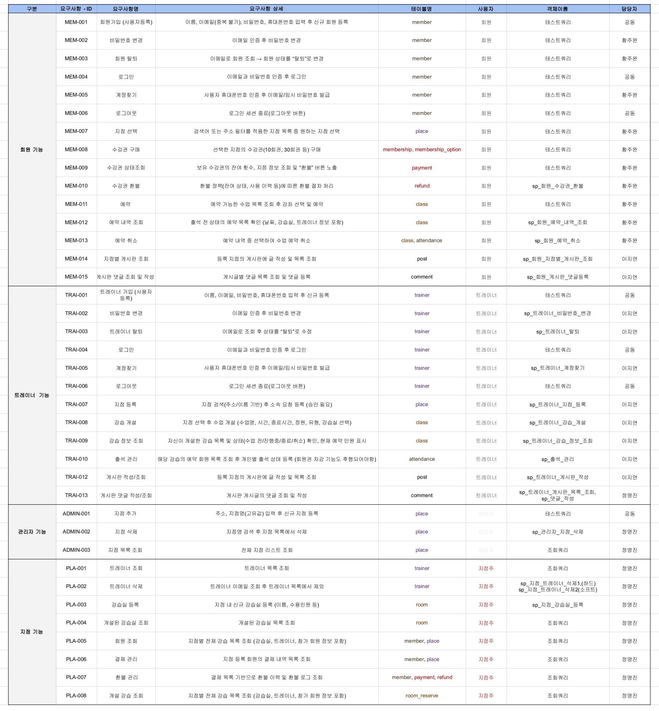
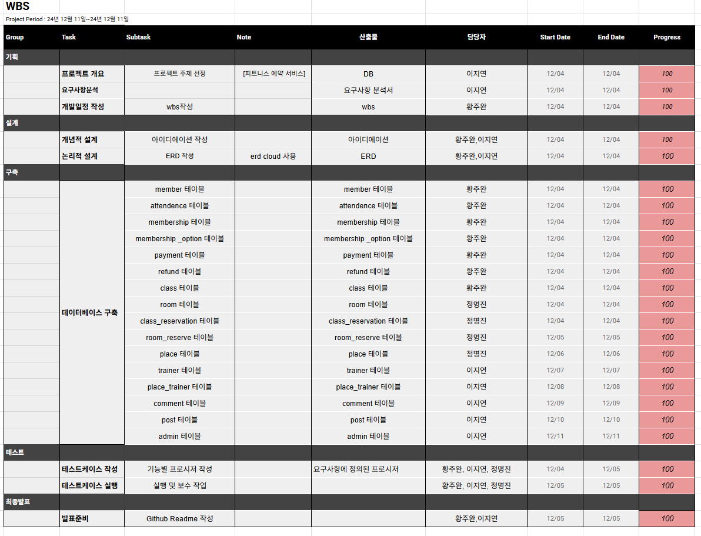

## 팀 소개

| 이지연 | 정명진 | 황주완 |
| --- | --- | --- |
|  |  |  |


***

## 프로젝트 개요

  <br/>
피트니스 센터의 지점, 회원, 트레이너 정보를 통합 관리하는 <b>수업 예약·출석·결제 관리 시스템</b>입니다.<br/>
회원·트레이너·관리자(지점 담당자)가 하나의 플랫폼에서 예약, 출석, 결제·환불, 커뮤니케이션을 편리하게 처리할 수 있도록 돕는 것을 목표로 합니다.

***

## 주요 기능 및 목표

- 피트니스 센터의 <b>지점·회원·트레이너 데이터를 한 번에 관리</b>할 수 있는 통합 플랫폼 구축
- 예약, 출석, 결제·환불, 커뮤니케이션까지 <b>운영 전 과정을 온라인으로 전환</b>하여 업무 효율 상승
- 실제 오프라인 센터 환경에서도 바로 사용할 수 있을 수준의 <b>실무 친화적인 시스템</b> 구현

### 회원(Member)

- 지점을 선택해 수강권(이용권)을 구매하고, 보유 수강권의<b>잔여 횟수 및 유효기간을 조회</b>할 수 있습니다.  
- 개인 일정에 맞춰 <b>수업을 예약·취소</b>하고, 출석 이력을 확인할 수 있습니다.  
- 지점 게시판과 댓글을 통해 트레이너와 소통하며, <b>이메일·휴대폰 인증 기반의 로그인, 계정 찾기, 비밀번호 변경</b> 기능을 제공합니다.

### 트레이너(Trainer)

- 소속 지점을 기준으로 <b>개인 또는 그룹 강습을 개설</b>하고, 강습별 <b>예약 현황과 진행 상태를 한눈에 조회</b>할 수 있습니다.  
- 출석 체크를 통해 회원 출석을 관리하고, <b>게시판 글·댓글 작성으로 지점 회원들과 소통</b>할 수 있습니다.  
- 트레이너 전용 <b>계정 관리(가입, 프로필 수정, 비밀번호 변경, 탈퇴)</b> 기능을 지원합니다.

### 관리자 / 지점(Admin / Branch)

- 지점, 강습실, 트레이너, 회원 정보를 <b>통합 관리</b>하며, 지점별 <b>강습, 예약, 결제·환불 이력</b>을 조회할 수 있습니다.  
- 트레이너 소속 승인, 지점별 게시판 관리, 수강권 상품 및 할인 정책 설정 등 <b>지점 운영 전반을 제어</b>합니다.  
- 통계를 통해 지점별 이용 현황을 파악하고, 운영 전략 수립에 참고할 수 있습니다.

***

## 프로젝트 산출물

### 요구사항 정의서


### WBS


### ERD


***

## 데이터베이스 아키텍쳐

### 데이터베이스 구축(DDL)
<details>
<summary>코드보기</summary>
  
  ``` sql
  -- 데이터베이스 생성
  CREATE DATABASE gymkkong;
  USE gymkkong;
  
  -- 회원
  CREATE TABLE member (
    id BIGINT AUTO_INCREMENT PRIMARY KEY,
    name VARCHAR(255) NOT NULL,
    email VARCHAR(255) NOT NULL UNIQUE,
    password  VARCHAR(255) NOT NULL ,
    phone_num VARCHAR(255),
    age VARCHAR(255),
    gender ENUM('m','f'),
    grade ENUM('BRONZE','GOLD','DIAMOND'),
    status ENUM('ACTIVE','INACTTIVE') NOT NULL DEFAULT 'ACTIVE'
  );
  
  -- 지점
  CREATE TABLE place (
    id BIGINT AUTO_INCREMENT PRIMARY KEY,
    name VARCHAR(255) NOT NULL,
    address VARCHAR(255) NOT NULL
  );
  
  -- 트레이너
  CREATE TABLE trainer (
    id BIGINT AUTO_INCREMENT PRIMARY KEY,
    name VARCHAR(255) NOT NULL,
    email VARCHAR(255) NOT NULL UNIQUE,
    password VARCHAR(255) NOT NULL,
    phone_num VARCHAR(255),
    status ENUM('ACTIVE','INACTTIVE') NOT NULL DEFAULT 'ACTIVE'
  );
  
  -- 강습실
  CREATE TABLE room (
    id BIGINT AUTO_INCREMENT PRIMARY KEY,
    place_id BIGINT NOT NULL,
    room_num INT NOT NULL,
    FOREIGN KEY (place_id) REFERENCES place(id)
  );
  
  -- 강의 (수업)
  CREATE TABLE class (
    id BIGINT AUTO_INCREMENT PRIMARY KEY,
    trainer_id BIGINT NOT NULL,
    room_id BIGINT NOT NULL,
    class_name VARCHAR(255) NOT NULL,
    start_time DATETIME NOT NULL,
    capacity INT NOT NULL,
    FOREIGN KEY (trainer_id) REFERENCES trainer(id),
    FOREIGN KEY (room_id) REFERENCES room(id)
  );
  
  -- 강의 예약
  CREATE TABLE class_reservation
  (
      id         BIGINT AUTO_INCREMENT PRIMARY KEY,
      class_id   BIGINT NOT NULL,
      member_id  BIGINT NOT NULL,
      reserved_at DATETIME DEFAULT CURRENT_TIMESTAMP,
      cancel_YN  ENUM('Y','N') DEFAULT 'N',
  
      FOREIGN KEY (class_id) REFERENCES class(id),
      FOREIGN KEY (member_id) REFERENCES member(id)
  );
  
  -- 출석
  CREATE TABLE attendance (
    id BIGINT AUTO_INCREMENT PRIMARY KEY,
    class_id BIGINT NOT NULL,
    member_id BIGINT NOT NULL,
    status ENUM('Y','N') DEFAULT 'N',
    CONSTRAINT uq_attendance_class_member
        UNIQUE (class_id, member_id),
    FOREIGN KEY (class_id) REFERENCES class(id),
    FOREIGN KEY (member_id) REFERENCES member(id)
  );
  
  -- 이용권 옵션
  CREATE TABLE membership_option (
    id BIGINT AUTO_INCREMENT PRIMARY KEY,
    class_id BIGINT NOT NULL,
    place_id BIGINT NOT NULL,
    count INT NOT NULL,
    price INT NOT NULL,
    FOREIGN KEY (class_id) REFERENCES class(id),
    FOREIGN KEY (place_id) REFERENCES place(id)
  );
  
  -- 이용권 (회원 구매)
  CREATE TABLE membership (
    id BIGINT AUTO_INCREMENT PRIMARY KEY,
    membership_option_id BIGINT NOT NULL,
    member_id BIGINT NOT NULL,
    refund_YN ENUM('Y','N') DEFAULT 'N',
    remain_count INT NOT NULL,
    FOREIGN KEY (membership_option_id) REFERENCES membership_option(id),
    FOREIGN KEY (member_id) REFERENCES member(id)
  );
  
  -- 결제
  CREATE TABLE payment (
    id BIGINT AUTO_INCREMENT PRIMARY KEY,
    membership_id BIGINT NOT NULL,
    pay_price BIGINT NOT NULL,
    pay_day DATETIME DEFAULT CURRENT_TIMESTAMP NOT NULL,
    FOREIGN KEY (membership_id) REFERENCES membership(id)
  );
  
  -- 환불
  CREATE TABLE refund (
    id BIGINT AUTO_INCREMENT PRIMARY KEY,
    payment_id BIGINT NOT NULL,
    refund_price BIGINT NOT NULL,
    refund_day DATETIME DEFAULT CURRENT_TIMESTAMP NOT NULL,
    FOREIGN KEY (payment_id) REFERENCES payment(id)
  );
  
  -- 지점-트레이너 관계
  CREATE TABLE place_trainer (
    id BIGINT AUTO_INCREMENT PRIMARY KEY,
    place_id BIGINT NOT NULL,
    trainer_id BIGINT NOT NULL,
    status ENUM('ACTIVE','INACTTIVE') NOT NULL DEFAULT 'ACTIVE',
    FOREIGN KEY (place_id) REFERENCES place(id),
    FOREIGN KEY (trainer_id) REFERENCES trainer(id)
  );
  
  -- 룸 예약
  CREATE TABLE room_reserve (
    id BIGINT AUTO_INCREMENT PRIMARY KEY,
    place_trainer_id BIGINT NOT NULL,
    room_id BIGINT NOT NULL,
    start_time DATETIME NOT NULL,
    FOREIGN KEY (place_trainer_id) REFERENCES place_trainer(id),
    FOREIGN KEY (room_id) REFERENCES room(id)
  );
  
  -- 게시글
  CREATE TABLE post (
    id BIGINT AUTO_INCREMENT PRIMARY KEY,
    place_trainer_id BIGINT NOT NULL,
    title VARCHAR(255) NOT NULL,
    contents VARCHAR(255) NOT NULL,
    post_date DATETIME DEFAULT CURRENT_TIMESTAMP NOT NULL,
    FOREIGN KEY (place_trainer_id) REFERENCES place_trainer(id)
  );
  
  -- 댓글
  CREATE TABLE comment (
    id BIGINT AUTO_INCREMENT PRIMARY KEY,
    post_id BIGINT NOT NULL,
    member_id BIGINT NOT NULL,
    contents VARCHAR(255) NOT NULL,
    comment_date DATETIME DEFAULT CURRENT_TIMESTAMP NOT NULL,
    FOREIGN KEY (post_id) REFERENCES post(id),
    FOREIGN KEY (member_id) REFERENCES member(id)
  );
  
  -- 관리자
  CREATE TABLE admin (
    id INT AUTO_INCREMENT PRIMARY KEY,
    name VARCHAR(255) NOT NULL,
    email VARCHAR(255) NOT NULL,
    password VARCHAR(255) NOT NULL,
    type ENUM('admin','super_admin') DEFAULT 'admin'
  );
  
  ```
</details>

### 샘플테이터 삽입
<details>
<summary>member 데이터 삽입</summary>
  
  ``` sql
    INSERT INTO member (name, email, phone_num, age, gender, grade) VALUES
  ('김철수', 'kim.scs@email.com', '010-1234-5678', '28', 'm', 'GOLD'),
  ('이영희', 'lee.y2h@email.com', '010-2345-6789', '32', 'f', 'DIAMOND'),
  ('박민수', 'park.m3s@email.com', '010-3456-7890', '25', 'm', 'BRONZE');
  ```
</details> 

<details>
<summary>place 데이터 삽입</summary>

  ``` sql
INSERT INTO place (name, address) VALUES
('짐꽁 강남점', '서울시 강남구 테헤란로 123'),
('짐꽁 홍대점', '서울시 마포구 양화로 456'),
('짐꽁 잠실점', '서울시 송파구 올림픽로 789');
```
</details> 

<details>
<summary>trainer 데이터 삽입</summary>

  ```sql
INSERT INTO trainer (name, email, phone_num) VALUES
('최트레이너', 'choia.trainer@gymkkong.com', '010-1111-2222'),
('정코치', 'juang.coach@gymkkong.com', '010-3333-4444'),
('한선생', 'hana.teacher@gymkkong.com', '010-5555-6666');
```
</details> 

<details>
<summary>room 데이터 삽입 (place 참조)</summary>

  ```sql
INSERT INTO room (place_id, room_num) VALUES
(1, 101),
(1, 102),
(2, 201);
```
</details> 

<details>
<summary>place_trainer 데이터 삽입 (place, trainer 참조)</summary>

  ```sql
INSERT INTO place_trainer (place_id, trainer_id, status) VALUES
(1, 1, 'Y'),
(1, 2, 'Y'),
(2, 3, 'Y');
```
</details> 

<details>
<summary>class 데이터 삽입 (trainer, room 참조)</summary>

  ```sql
INSERT INTO class (trainer_id, room_id, class_name, start_time, capacity) VALUES
(1, 1, '아침 요가 클래스', '2024-12-05 07:00:00', 15),
(2, 2, '근력 운동 클래스', '2024-12-05 19:00:00', 10),
(3, 3, '필라테스 클래스', '2024-12-05 10:00:00', 12);
```

</details> 

<details>
<summary>attendance 데이터 삽입 (class, member 참조)</summary>

  ```sql
INSERT INTO attendance (class_id, member_id, status) VALUES
(1, 1, 'Y'),
(1, 2, 'Y'),
(2, 3, 'N');
```
</details> 

<details>
<summary>membership_option 데이터 삽입 (class, place 참조)</summary>
  
  ``` sql
INSERT INTO membership_option (class_id, place_id, count, price) VALUES
(1, 1, 10, 150000),
(2, 1, 20, 280000),
(3, 2, 15, 200000);
```
</details> 

<details>
<summary>room_reserve 데이터 삽입 (place_trainer, room 참조)</summary>

  ```sql
INSERT INTO room_reserve (place_trainer_id, room_id, start_time) VALUES
(1, 1, '2024-12-06 08:00:00'),
(2, 2, '2024-12-06 18:00:00'),
(3, 3, '2024-12-06 11:00:00');
```
</details> 

<details>
<summary>post 데이터 삽입 (place_trainer 참조)</summary>

  ```sql
INSERT INTO post (place_trainer_id, title, post_contents, post_day) VALUES
(1, '새로운 요가 프로그램 안내', '12월부터 새로운 요가 프로그램이 시작됩니다!', '2024-11-28 09:00:00'),
(2, '연말 특별 이벤트', '12월 한달간 특별 할인 이벤트를 진행합니다.', '2024-11-29 10:30:00'),
(3, '필라테스 입문 가이드', '필라테스 초보자를 위한 안내 글입니다.', '2024-11-30 14:00:00');
```
</details> 

<details>
<summary>membership 데이터 삽입 (membership_option, member 참조)</summary>

  ```sql
INSERT INTO membership (membership_option_id, member_id, refund_YN, remain_count) VALUES
(1, 1, 'N', 8),
(2, 2, 'N', 20),
(3, 3, 'N', 12);
```
</details> 

<details>
<summary>coment 데이터 삽입 (post, member 참조)</summary>

  ```sql
INSERT INTO coment (post_id, member_id, comment_contents, comment_day) VALUES
(1, 1, '요가 프로그램 기대됩니다!', '2024-11-28 10:00:00'),
(2, 2, '할인 이벤트 감사합니다~', '2024-11-29 11:00:00'),
(3, 3, '필라테스 처음인데 도움 많이 됐어요', '2024-11-30 15:00:00');
```
</details> 

<details>
<summary>payment 데이터 삽입 (membership 참조)</summary>
  
  ```sql
INSERT INTO payment (membership_id, pay_price, pay_day) VALUES
(1, 150000, '2024-11-01 14:30:00'),
(2, 280000, '2024-11-05 16:20:00'),
(3, 200000, '2024-11-10 11:00:00');
```
</details> 

<details>
<summary>refund 데이터 삽입 (payment 참조)</summary>

  ```sql
INSERT INTO refund (payment_id, refund_price, refund_day) VALUES
(1, 50000, '2024-11-15 10:00:00'),
(2, 100000, '2024-11-20 15:30:00'),
(3, 80000, '2024-11-25 13:45:00');
```
</details> 

<details>
<summary>admin 데이터 삽입 (외래키 없음)/summary>

  ```sql
INSERT INTO admin (name, email, password, type) VALUES
('최관리자', 'admin.choi@gymkkong.com', 'hashed_password_123', 'super_admin'),
('김매니저', 'manager.kim@gymkkong.com', 'hashed_password_456', 'admin'),
('이스태프', 'staff.lee@gymkkong.com', 'hashed_password_789', 'admin');
```
</details> 

### 테스트 케이스 실행


