# 아키텍처

앱 · API · DB가 어떻게 나뉘어 있고, 요청이 어떤 경로로 흐르는지 정리한 문서입니다.
권한 설계는 분량이 커서 [rbac.md](rbac.md)로 따로 뺐습니다.

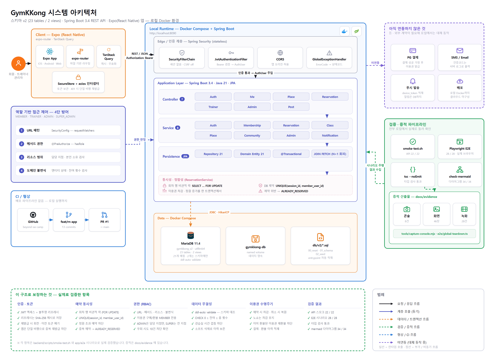

> 위 도식은 `node tools/build-architecture.mjs`로 그립니다. 구조가 바뀌면 다시 돌려 갱신하세요.

- [1. 전체 구성](#1-전체-구성)
- [2. 백엔드 레이어](#2-백엔드-레이어)
- [3. 앱 구조](#3-앱-구조)
- [4. 데이터 모델](#4-데이터-모델)
- [5. 시퀀스 플로우](#5-시퀀스-플로우)
- [6. 동시성 설계](#6-동시성-설계)
- [7. 개발 · 검증 파이프라인](#7-개발--검증-파이프라인)

---

## 1. 전체 구성

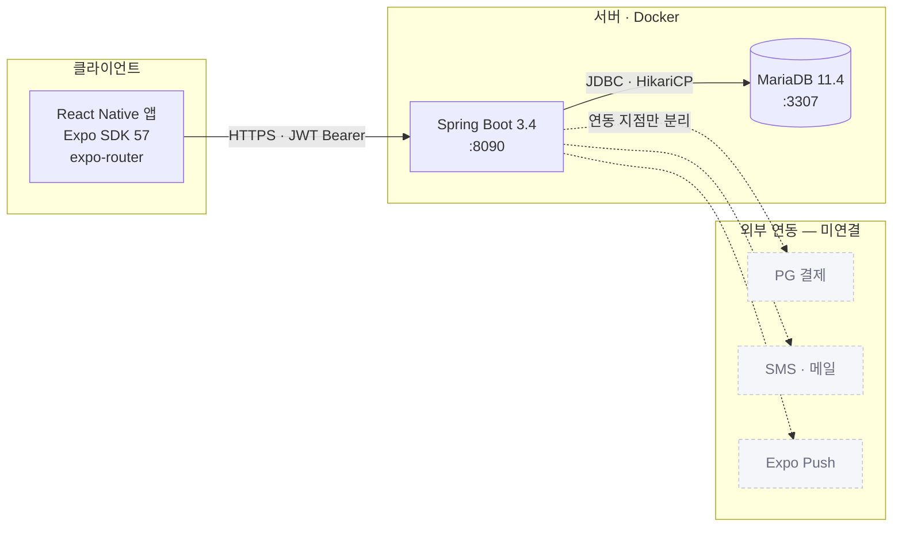
```mermaid
graph LR
  subgraph client["클라이언트"]
    APP["React Native 앱<br/>Expo SDK 57<br/>expo-router"]
  end

  subgraph server["서버 · Docker"]
    API["Spring Boot 3.4<br/>:8090"]
    DB[("MariaDB 11.4<br/>:3307")]
  end

  subgraph ext["외부 연동 — 미연결"]
    PG["PG 결제"]
    SMS["SMS · 메일"]
    PUSH["Expo Push"]
  end

  APP -->|"HTTPS · JWT Bearer"| API
  API -->|"JDBC · HikariCP"| DB
  API -.->|"연동 지점만 분리"| PG
  API -.-> SMS
  API -.-> PUSH

  classDef dim fill:#f5f6fa,stroke:#c3c5d4,color:#6a6d80,stroke-dasharray:4 3
  class PG,SMS,PUSH dim
```

점선은 붙이지 않은 연동입니다. 동작을 흉내내지 않고 호출 지점만 한 곳씩 분리해 두었습니다
— `MembershipService.purchase`, `AuthService.sendVerificationCode`, `NotificationService.sendPush`.

| 구성 요소 | 선택 | 이유 |
| --- | --- | --- |
| 앱 | Expo (관리형) | 네이티브 빌드 없이 실기기 확인이 가능하고, 웹으로도 띄울 수 있어 E2E를 브라우저에서 돌린다 |
| 상태·캐시 | TanStack Query | 서버 상태를 화면마다 복제하지 않는다. 예약 후 무효화만으로 잔여 횟수가 전 화면에 반영된다 |
| 인증 | JWT + 리프레시 토큰 | 서버 세션이 없어 스케일아웃이 자유롭다. 리프레시는 DB에 해시로 저장해 폐기가 가능하다 |
| 스키마 | SQL 파일이 소유 | `ddl-auto: validate`. JPA가 스키마를 만들지 않으므로 운영과 개발이 갈라지지 않는다 |

---

## 2. 백엔드 레이어

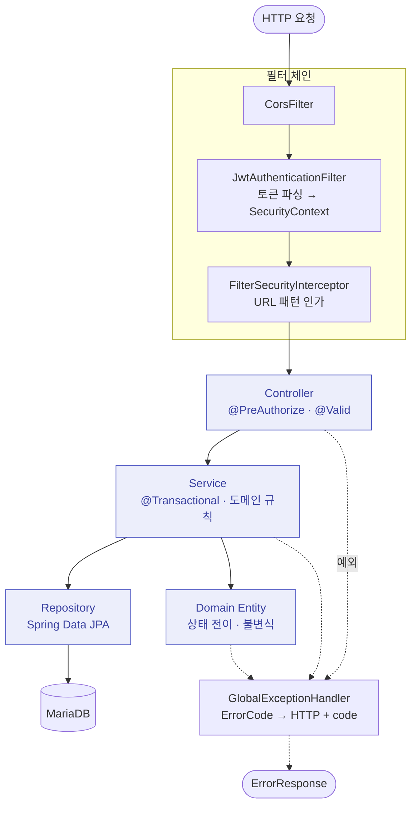
```mermaid
graph TB
  REQ(["HTTP 요청"]) --> F1

  subgraph filter["필터 체인"]
    F1["CorsFilter"] --> F2["JwtAuthenticationFilter<br/>토큰 파싱 → SecurityContext"]
    F2 --> F3["FilterSecurityInterceptor<br/>URL 패턴 인가"]
  end

  F3 --> C["Controller<br/>@PreAuthorize · @Valid"]
  C --> S["Service<br/>@Transactional · 도메인 규칙"]
  S --> D["Domain Entity<br/>상태 전이 · 불변식"]
  S --> R["Repository<br/>Spring Data JPA"]
  R --> DB[("MariaDB")]

  C -.->|예외| EH["GlobalExceptionHandler<br/>ErrorCode → HTTP + code"]
  S -.-> EH
  D -.-> EH
  EH -.-> RES(["ErrorResponse"])

  classDef layer fill:#eceefb,stroke:#4c55c2,color:#3a41a0
  class C,S,D,R layer
```

### 레이어별 책임

| 레이어 | 하는 일 | 하지 않는 일 |
| --- | --- | --- |
| Controller | 입력 검증(`@Valid`), 역할 인가(`@PreAuthorize`), DTO 변환 | 비즈니스 판단 |
| Service | 트랜잭션 경계, 락 획득, 리소스 소유권 검사, 여러 엔티티 조율 | HTTP를 모른다 |
| Domain | 상태 전이와 불변식 (`Reservation.cancelByMember`, `Membership.use`) | 저장소를 모른다 |
| Repository | 조회. `JOIN FETCH`로 N+1 회피, 비관적 락 선언 | 규칙 판단 |

**규칙을 엔티티에 두는 이유.** 예를 들어 "잔여 0회면 쓸 수 없다"는 `Membership.use()` 안에 있습니다.
서비스가 여러 곳에서 호출해도 규칙이 한 군데에만 있어 빠뜨릴 수 없습니다.

```java
// Membership.java — 서비스가 아니라 엔티티가 스스로를 지킨다
public void use() {
    if (status != ACTIVE)   throw new ApiException(NO_USABLE_MEMBERSHIP);
    if (isExpired())        throw new ApiException(MEMBERSHIP_EXPIRED);
    if (remainCount <= 0)   throw new ApiException(MEMBERSHIP_EXHAUSTED);
    this.remainCount--;
}
```

### 오류 처리

도메인 예외마다 코드를 부여해 앱이 문구가 아니라 코드로 분기합니다.

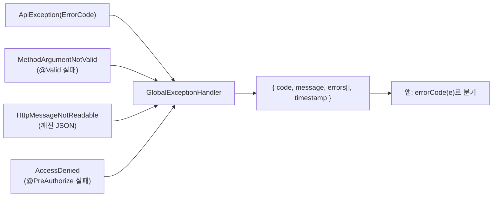
```mermaid
flowchart LR
  A["ApiException(ErrorCode)"] --> H["GlobalExceptionHandler"]
  B["MethodArgumentNotValid<br/>(@Valid 실패)"] --> H
  C["HttpMessageNotReadable<br/>(깨진 JSON)"] --> H
  D["AccessDenied<br/>(@PreAuthorize 실패)"] --> H
  H --> R["{ code, message, errors[], timestamp }"]
  R --> APP["앱: errorCode(e)로 분기"]
```

예약 실패 시 `NO_USABLE_MEMBERSHIP`이면 이용권 구매 화면으로 유도하고,
`SESSION_FULL`이면 그대로 알립니다. 문구를 파싱하지 않습니다.

---

## 3. 앱 구조

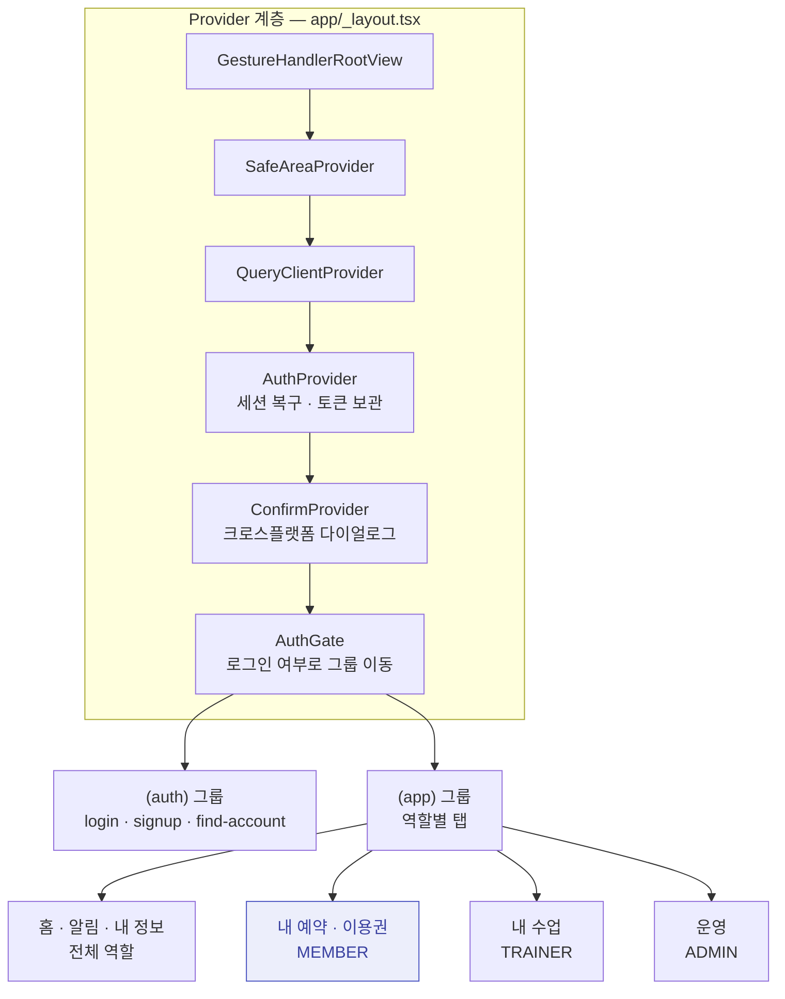
```mermaid
graph TB
  subgraph providers["Provider 계층 — app/_layout.tsx"]
    GH["GestureHandlerRootView"] --> SA["SafeAreaProvider"]
    SA --> QC["QueryClientProvider"]
    QC --> AU["AuthProvider<br/>세션 복구 · 토큰 보관"]
    AU --> CF["ConfirmProvider<br/>크로스플랫폼 다이얼로그"]
    CF --> AG["AuthGate<br/>로그인 여부로 그룹 이동"]
  end

  AG --> AUTH["(auth) 그룹<br/>login · signup · find-account"]
  AG --> APPG["(app) 그룹<br/>역할별 탭"]

  APPG --> T1["홈 · 알림 · 내 정보<br/>전체 역할"]
  APPG --> T2["내 예약 · 이용권<br/>MEMBER"]
  APPG --> T3["내 수업<br/>TRAINER"]
  APPG --> T4["운영<br/>ADMIN"]

  classDef m fill:#eceefb,stroke:#4c55c2,color:#3a41a0
  class T2 m
```

### 디렉터리

```
app/
├─ app/                       expo-router 파일 기반 라우팅
│  ├─ _layout.tsx             Provider 조립 + AuthGate
│  ├─ (auth)/                 비로그인 화면
│  ├─ (app)/                  탭 화면 (역할별 노출)
│  ├─ place/[id].tsx          지점 상세
│  ├─ session/[id].tsx        수업 상세 · 예약
│  ├─ post/[id].tsx           게시글 · 댓글
│  └─ roster/[sessionId].tsx  출석 관리
└─ src/
   ├─ api/       client(axios+인터셉터) · hooks(React Query) · types(서버 DTO 대응)
   ├─ components/ Logo · Icon · ui · ConfirmProvider · FormSheet
   └─ lib/       AuthProvider · tokenStore · format
```

### 서버 상태 무효화

예약 하나가 바뀌면 여러 화면이 함께 틀어집니다. 그래서 변경 훅이 관련 쿼리를 한 번에 무효화합니다.

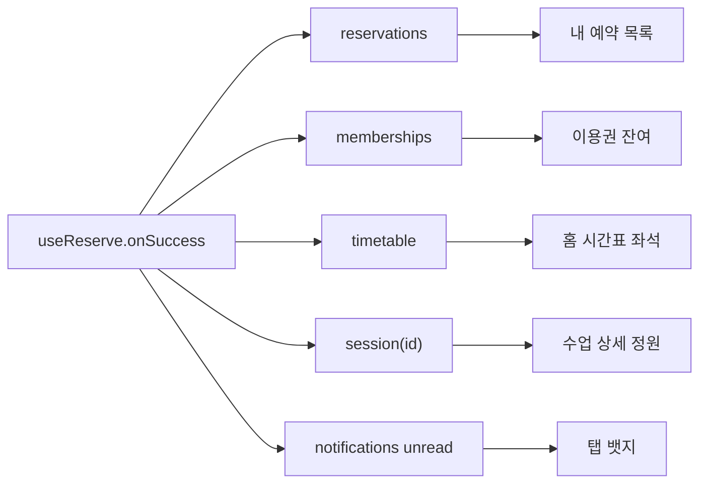
```mermaid
graph LR
  M["useReserve.onSuccess"] --> A["reservations"]
  M --> B["memberships"]
  M --> C["timetable"]
  M --> D["session(id)"]
  M --> E["notifications unread"]

  A --> S1["내 예약 목록"]
  B --> S2["이용권 잔여"]
  C --> S3["홈 시간표 좌석"]
  D --> S4["수업 상세 정원"]
  E --> S5["탭 뱃지"]
```

이 무효화가 빠지면 "예약은 됐는데 이용권 잔여가 그대로"처럼 화면끼리 어긋납니다.

---

## 4. 데이터 모델

핵심 흐름(예약)에 관여하는 테이블만 추렸습니다. 전체 스키마는 [db/v2/01_schema.sql](../db/v2/01_schema.sql),
v1에서 무엇을 왜 바꿨는지는 [schema-v2.md](schema-v2.md)에 있습니다.

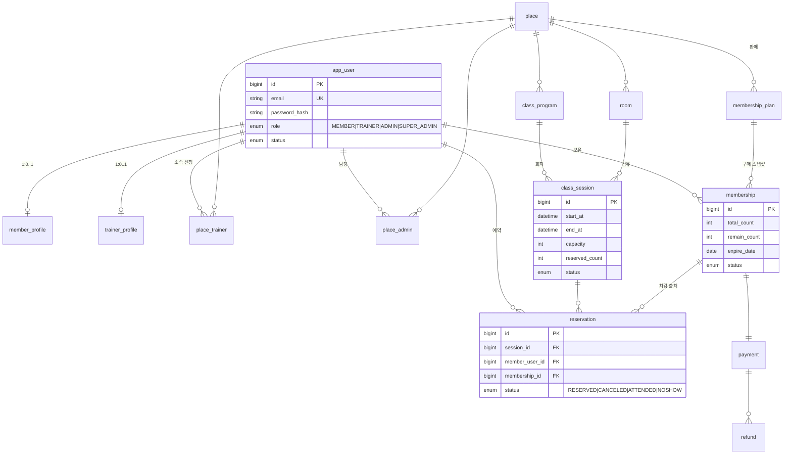
```mermaid
erDiagram
  app_user ||--o| member_profile : "1:0..1"
  app_user ||--o| trainer_profile : "1:0..1"
  app_user ||--o{ place_trainer : "소속 신청"
  app_user ||--o{ place_admin : "담당"
  app_user ||--o{ membership : "보유"
  app_user ||--o{ reservation : "예약"

  place ||--o{ room : ""
  place ||--o{ place_trainer : ""
  place ||--o{ place_admin : ""
  place ||--o{ membership_plan : "판매"
  place ||--o{ class_program : ""

  class_program ||--o{ class_session : "회차"
  room ||--o{ class_session : "점유"
  class_session ||--o{ reservation : ""

  membership_plan ||--o{ membership : "구매 스냅샷"
  membership ||--o{ reservation : "차감 출처"
  membership ||--|| payment : ""
  payment ||--o{ refund : ""

  app_user {
    bigint id PK
    string email UK
    string password_hash
    enum role "MEMBER|TRAINER|ADMIN|SUPER_ADMIN"
    enum status
  }
  class_session {
    bigint id PK
    datetime start_at
    datetime end_at
    int capacity
    int reserved_count
    enum status
  }
  reservation {
    bigint id PK
    bigint session_id FK
    bigint member_user_id FK
    bigint membership_id FK
    enum status "RESERVED|CANCELED|ATTENDED|NOSHOW"
  }
  membership {
    bigint id PK
    int total_count
    int remain_count
    date expire_date
    enum status
  }
```

**핵심 제약 세 가지**

| 제약 | 위치 | 막는 것 |
| --- | --- | --- |
| `UNIQUE (session_id, member_user_id)` | `reservation` | 같은 회차 중복 예약 |
| `UNIQUE (room_id, start_at)` | `class_session` | 같은 방 같은 시각 중복 개설 |
| `CHECK (remain_count BETWEEN 0 AND total_count)` | `membership` | 잔여 횟수가 음수가 되는 상황 |

---

## 5. 시퀀스 플로우

### 5.1 로그인과 토큰 재발급

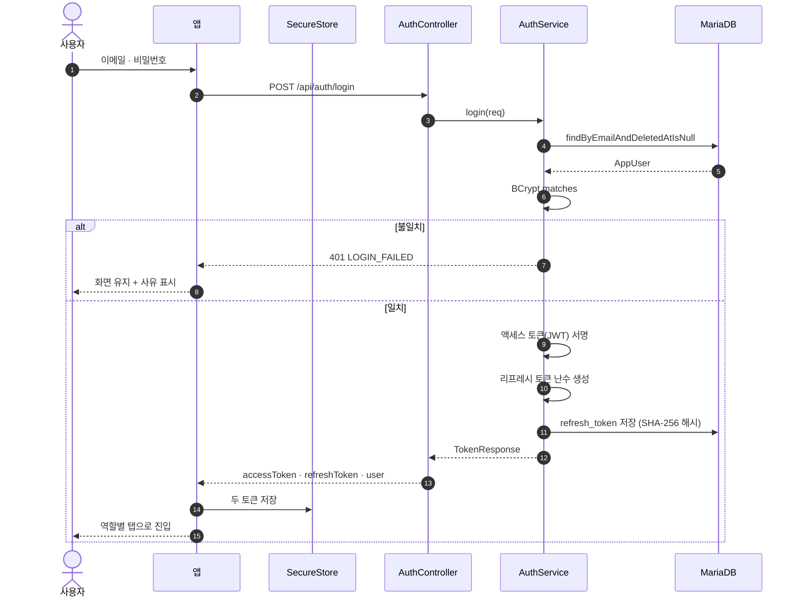
```mermaid
sequenceDiagram
  autonumber
  actor U as 사용자
  participant APP as 앱
  participant ST as SecureStore
  participant API as AuthController
  participant SV as AuthService
  participant DB as MariaDB

  U->>APP: 이메일 · 비밀번호
  APP->>API: POST /api/auth/login
  API->>SV: login(req)
  SV->>DB: findByEmailAndDeletedAtIsNull
  DB-->>SV: AppUser
  SV->>SV: BCrypt.matches
  alt 불일치
    SV-->>APP: 401 LOGIN_FAILED
    APP-->>U: 화면 유지 + 사유 표시
  else 일치
    SV->>SV: 액세스 토큰(JWT) 서명
    SV->>SV: 리프레시 토큰 난수 생성
    SV->>DB: refresh_token 저장 (SHA-256 해시)
    SV-->>API: TokenResponse
    API-->>APP: accessToken · refreshToken · user
    APP->>ST: 두 토큰 저장
    APP-->>U: 역할별 탭으로 진입
  end
```

리프레시 토큰은 **원문을 저장하지 않습니다.** DB가 유출돼도 토큰을 재사용할 수 없습니다.

액세스 토큰이 만료되면 인터셉터가 자동으로 재발급합니다. 만료 시점에 여러 요청이 동시에
401을 받아도 **갱신은 한 번만** 일어납니다.

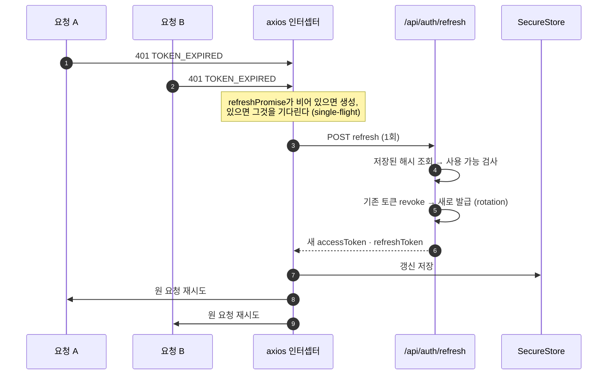
```mermaid
sequenceDiagram
  autonumber
  participant R1 as 요청 A
  participant R2 as 요청 B
  participant IC as axios 인터셉터
  participant API as /api/auth/refresh
  participant ST as SecureStore

  R1->>IC: 401 TOKEN_EXPIRED
  R2->>IC: 401 TOKEN_EXPIRED
  Note over IC: refreshPromise가 비어 있으면 생성,<br/>있으면 그것을 기다린다 (single-flight)
  IC->>API: POST refresh (1회)
  API->>API: 저장된 해시 조회 → 사용 가능 검사
  API->>API: 기존 토큰 revoke → 새로 발급 (rotation)
  API-->>IC: 새 accessToken · refreshToken
  IC->>ST: 갱신 저장
  IC->>R1: 원 요청 재시도
  IC->>R2: 원 요청 재시도
```

재발급도 실패하면 세션을 비우고 로그인 화면으로 보냅니다.
비밀번호를 바꾸면 그 계정의 리프레시 토큰을 전부 폐기합니다.

---

### 5.2 수업 예약 — 핵심 플로우

v1 스키마에는 이 흐름이 **아예 없었습니다**(`INSERT INTO class_reservation` 0건).
정원·중복·이용권을 한 트랜잭션에서 처리합니다.

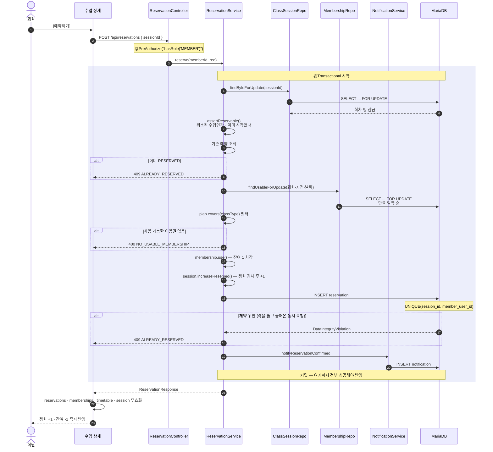
```mermaid
sequenceDiagram
  autonumber
  actor M as 회원
  participant APP as 수업 상세
  participant RC as ReservationController
  participant RS as ReservationService
  participant SR as ClassSessionRepo
  participant MR as MembershipRepo
  participant NS as NotificationService
  participant DB as MariaDB

  M->>APP: [예약하기]
  APP->>RC: POST /api/reservations { sessionId }
  Note over RC: @PreAuthorize("hasRole('MEMBER')")
  RC->>RS: reserve(memberId, req)

  rect rgb(236,238,251)
    Note over RS,DB: @Transactional 시작
    RS->>SR: findByIdForUpdate(sessionId)
    SR->>DB: SELECT ... FOR UPDATE
    DB-->>SR: 회차 행 잠금
    RS->>RS: assertReservable()<br/>취소된 수업인가 · 이미 시작했나

    RS->>RS: 기존 예약 조회
    alt 이미 RESERVED
      RS-->>APP: 409 ALREADY_RESERVED
    end

    RS->>MR: findUsableForUpdate(회원·지점·날짜)
    MR->>DB: SELECT ... FOR UPDATE<br/>만료 임박 순
    RS->>RS: plan.covers(classType) 필터
    alt 사용 가능한 이용권 없음
      RS-->>APP: 400 NO_USABLE_MEMBERSHIP
    end

    RS->>RS: membership.use() — 잔여 1 차감
    RS->>RS: session.increaseReserved() — 정원 검사 후 +1
    RS->>DB: INSERT reservation
    Note over DB: UNIQUE(session_id, member_user_id)
    alt 제약 위반 (락을 뚫고 들어온 동시 요청)
      DB-->>RS: DataIntegrityViolation
      RS-->>APP: 409 ALREADY_RESERVED
    end
    RS->>NS: notifyReservationConfirmed
    NS->>DB: INSERT notification
    Note over RS,DB: 커밋 — 여기까지 전부 성공해야 반영
  end

  RS-->>APP: ReservationResponse
  APP->>APP: reservations · memberships · timetable · session 무효화
  APP-->>M: 정원 +1 · 잔여 -1 즉시 반영
```

**이용권 자동 선택 규칙**

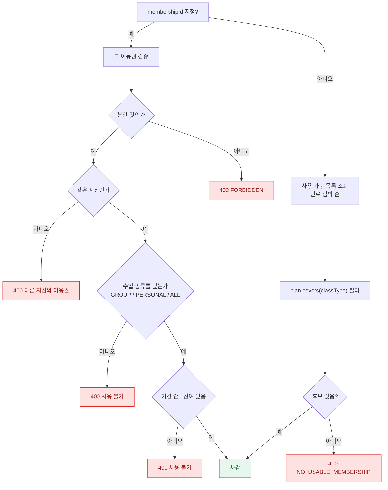
```mermaid
flowchart TD
  A["membershipId 지정?"] -->|예| B["그 이용권 검증"]
  A -->|아니오| C["사용 가능 목록 조회<br/>만료 임박 순"]
  B --> B1{"본인 것인가"} -->|아니오| X1["403 FORBIDDEN"]
  B1 -->|예| B2{"같은 지점인가"} -->|아니오| X2["400 다른 지점의 이용권"]
  B2 -->|예| B3{"수업 종류를 덮는가<br/>GROUP / PERSONAL / ALL"} -->|아니오| X3["400 사용 불가"]
  B3 -->|예| B4{"기간 안 · 잔여 있음"} -->|아니오| X4["400 사용 불가"]
  B4 -->|예| OK["차감"]
  C --> C1["plan.covers(classType) 필터"]
  C1 --> C2{"후보 있음?"} -->|아니오| X5["400 NO_USABLE_MEMBERSHIP"]
  C2 -->|예| OK

  classDef err fill:#fee2e2,stroke:#dc2626,color:#991b1b
  classDef ok fill:#e7f7ee,stroke:#12a150,color:#0b6b36
  class X1,X2,X3,X4,X5 err
  class OK ok
```

---

### 5.3 예약 취소 — 이용권 복원

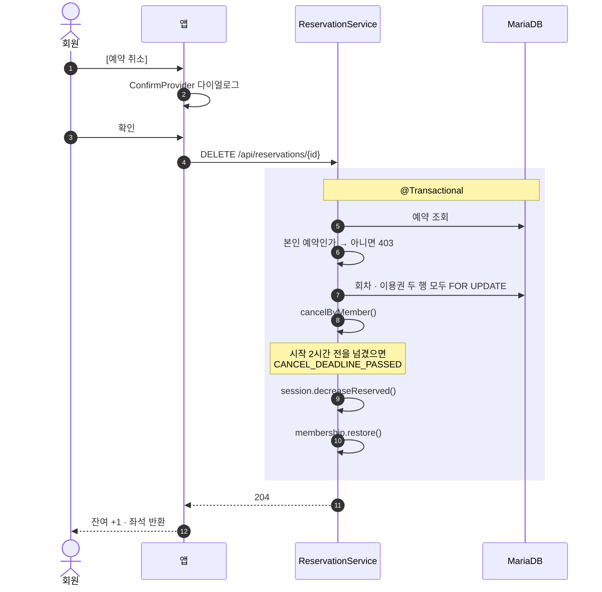
```mermaid
sequenceDiagram
  autonumber
  actor M as 회원
  participant APP as 앱
  participant RS as ReservationService
  participant DB as MariaDB

  M->>APP: [예약 취소]
  APP->>APP: ConfirmProvider 다이얼로그
  M->>APP: 확인
  APP->>RS: DELETE /api/reservations/{id}

  rect rgb(236,238,251)
    Note over RS,DB: @Transactional
    RS->>DB: 예약 조회
    RS->>RS: 본인 예약인가 → 아니면 403
    RS->>DB: 회차 · 이용권 두 행 모두 FOR UPDATE
    RS->>RS: cancelByMember()
    Note over RS: 시작 2시간 전을 넘겼으면<br/>CANCEL_DEADLINE_PASSED
    RS->>RS: session.decreaseReserved()
    RS->>RS: membership.restore()
  end

  RS-->>APP: 204
  APP-->>M: 잔여 +1 · 좌석 반환
```

취소 주체에 따라 정책이 다릅니다.

| 주체 | 기한 제약 | 이용권 |
| --- | --- | --- |
| 회원 본인 | 시작 2시간 전까지 | 복원 |
| 트레이너의 수업 취소 | 없음 | 예약자 **전원** 복원 |
| 노쇼 처리 | — | 복원하지 않음 |

---

### 5.4 트레이너 — 강습 개설과 출석

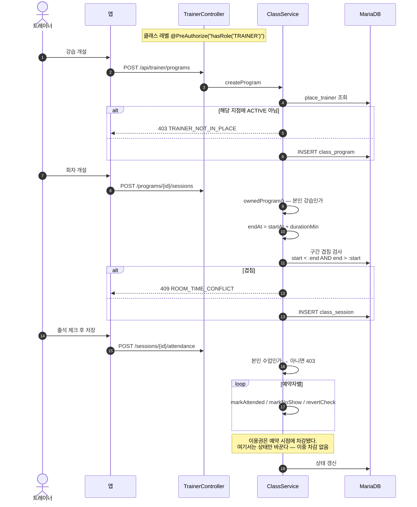
```mermaid
sequenceDiagram
  autonumber
  actor T as 트레이너
  participant APP as 앱
  participant TC as TrainerController
  participant CS as ClassService
  participant DB as MariaDB

  Note over TC: 클래스 레벨 @PreAuthorize("hasRole('TRAINER')")

  T->>APP: 강습 개설
  APP->>TC: POST /api/trainer/programs
  TC->>CS: createProgram
  CS->>DB: place_trainer 조회
  alt 해당 지점에 ACTIVE 아님
    CS-->>APP: 403 TRAINER_NOT_IN_PLACE
  else
    CS->>DB: INSERT class_program
  end

  T->>APP: 회차 개설
  APP->>TC: POST /programs/{id}/sessions
  CS->>CS: ownedProgram() — 본인 강습인가
  CS->>CS: endAt = startAt + durationMin
  CS->>DB: 구간 겹침 검사<br/>start < :end AND end > :start
  alt 겹침
    CS-->>APP: 409 ROOM_TIME_CONFLICT
  else
    CS->>DB: INSERT class_session
  end

  T->>APP: 출석 체크 후 저장
  APP->>TC: POST /sessions/{id}/attendance
  CS->>CS: 본인 수업인가 → 아니면 403
  loop 예약자별
    CS->>CS: markAttended / markNoShow / revertCheck
  end
  Note over CS: 이용권은 예약 시점에 차감됐다.<br/>여기서는 상태만 바꾼다 — 이중 차감 없음
  CS->>DB: 상태 갱신
```

**강습실 충돌 판정.** v1은 1시간을 하드코딩했고 `room_reserve`라는 별도 경로가 있어
같은 방이 이중으로 잡힐 수 있었습니다. v2는 `class_session`이 점유의 유일한 소스이고
실제 구간 겹침으로 판정합니다.

```mermaid
gantt
  title 같은 강습실의 겹침 판정
  dateFormat HH:mm
  axisFormat %H:%M
  section 101번 룸
  기존 · 아침 요가 07:00-08:00    :done, a, 07:00, 60m
  신규 · 겹침 → 거부 07:30-08:20   :crit, b, 07:30, 50m
  신규 · 허용 08:00-09:00          :active, c, 08:00, 60m
```

경계가 맞닿는 08:00 시작은 허용합니다 (`start < :end` 이므로 `08:00 < 08:00`은 거짓).

---

### 5.5 관리자 — 환불 승인

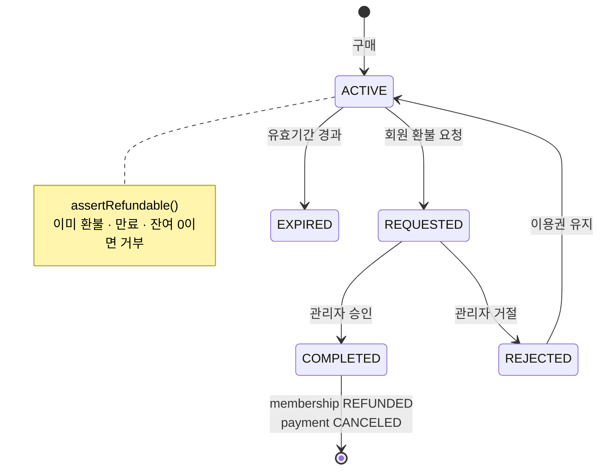
```mermaid
stateDiagram-v2
  [*] --> ACTIVE : 구매
  ACTIVE --> REQUESTED : 회원 환불 요청
  note right of ACTIVE
    assertRefundable()
    이미 환불 · 만료 · 잔여 0이면 거부
  end note
  REQUESTED --> COMPLETED : 관리자 승인
  REQUESTED --> REJECTED : 관리자 거절
  REJECTED --> ACTIVE : 이용권 유지
  COMPLETED --> [*] : membership REFUNDED<br/>payment CANCELED
  ACTIVE --> EXPIRED : 유효기간 경과
```

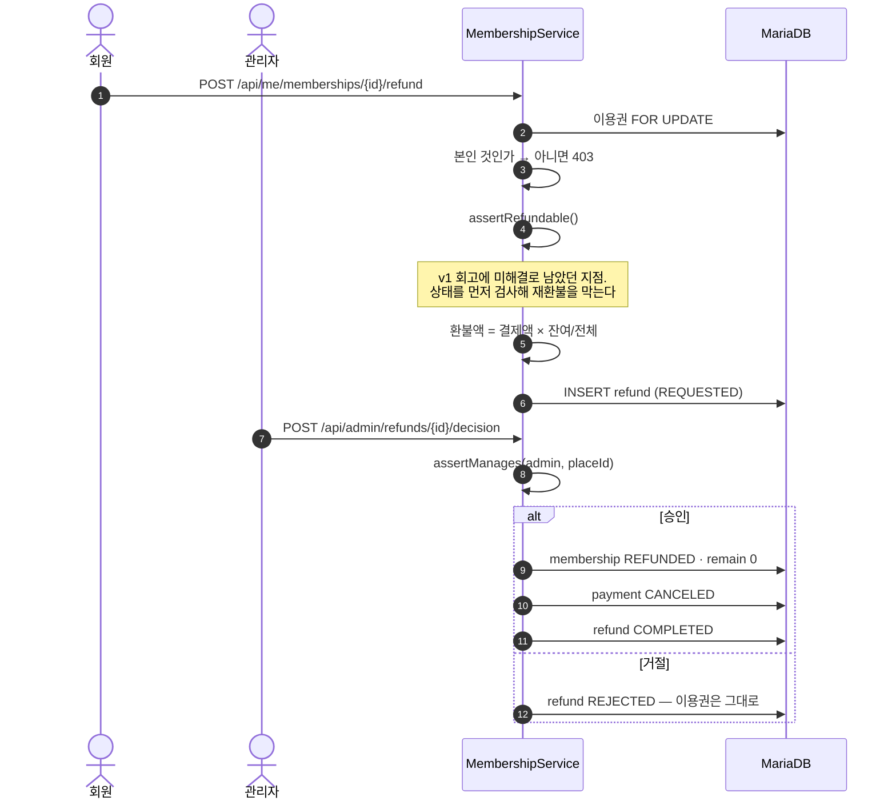
```mermaid
sequenceDiagram
  autonumber
  actor M as 회원
  actor A as 관리자
  participant MS as MembershipService
  participant DB as MariaDB

  M->>MS: POST /api/me/memberships/{id}/refund
  MS->>DB: 이용권 FOR UPDATE
  MS->>MS: 본인 것인가 → 아니면 403
  MS->>MS: assertRefundable()
  Note over MS: v1 회고에 미해결로 남았던 지점.<br/>상태를 먼저 검사해 재환불을 막는다
  MS->>MS: 환불액 = 결제액 × 잔여/전체
  MS->>DB: INSERT refund (REQUESTED)

  A->>MS: POST /api/admin/refunds/{id}/decision
  MS->>MS: assertManages(admin, placeId)
  alt 승인
    MS->>DB: membership REFUNDED · remain 0
    MS->>DB: payment CANCELED
    MS->>DB: refund COMPLETED
  else 거절
    MS->>DB: refund REJECTED — 이용권은 그대로
  end
```

---

## 6. 동시성 설계

정원이 1자리 남았을 때 두 사람이 동시에 누르는 상황을 다룹니다.

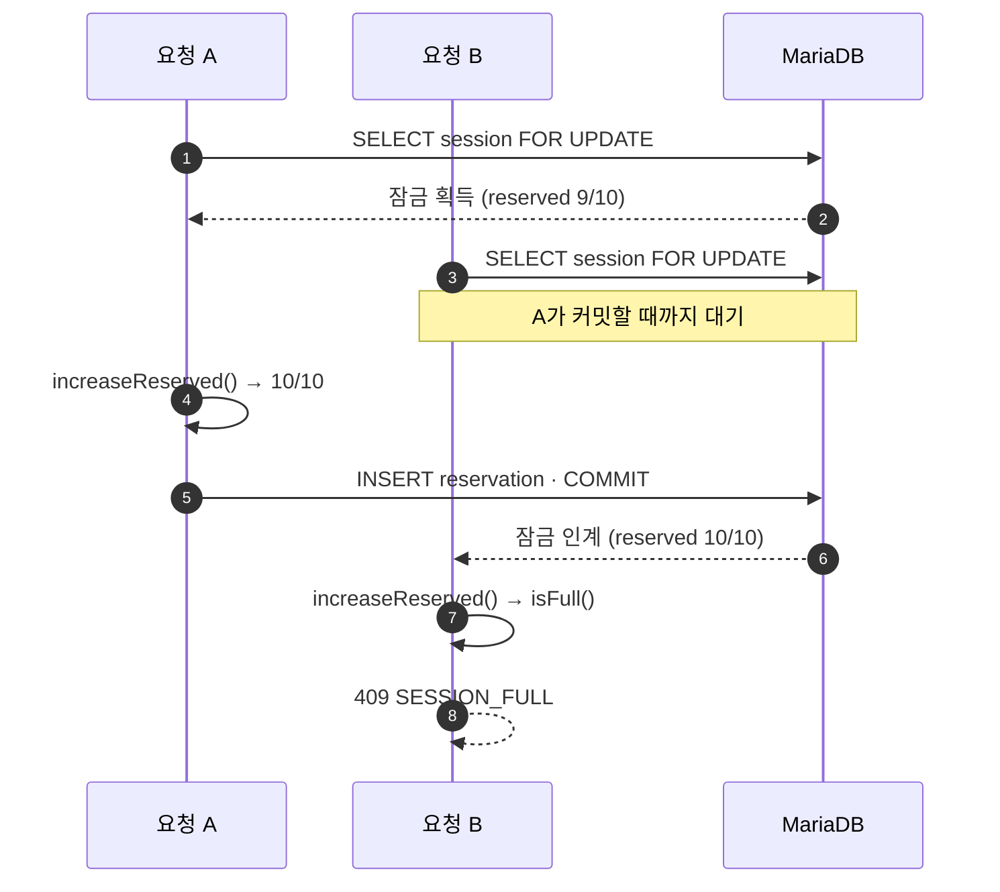
```mermaid
sequenceDiagram
  autonumber
  participant A as 요청 A
  participant B as 요청 B
  participant DB as MariaDB

  A->>DB: SELECT session FOR UPDATE
  DB-->>A: 잠금 획득 (reserved 9/10)
  B->>DB: SELECT session FOR UPDATE
  Note over B,DB: A가 커밋할 때까지 대기
  A->>A: increaseReserved() → 10/10
  A->>DB: INSERT reservation · COMMIT
  DB-->>B: 잠금 인계 (reserved 10/10)
  B->>B: increaseReserved() → isFull()
  B-->>B: 409 SESSION_FULL
```

방어를 두 겹으로 둡니다.

| 층 | 수단 | 담당 |
| --- | --- | --- |
| 1차 | `SELECT ... FOR UPDATE` (회차 · 이용권) | 순서를 직렬화해 정원·잔여 계산을 독점 |
| 2차 | `UNIQUE (session_id, member_user_id)` | 락을 벗어난 경로까지 최종 차단 |

2차에서 걸린 제약 위반은 `DataIntegrityViolationException`으로 올라오는데,
그대로 500을 내보내지 않고 `ALREADY_RESERVED`로 바꿔 앱이 이해할 수 있게 합니다.

락 순서는 항상 **회차 → 이용권**으로 고정합니다. 교착을 피하기 위한 규칙입니다.

---

## 7. 개발 · 검증 파이프라인

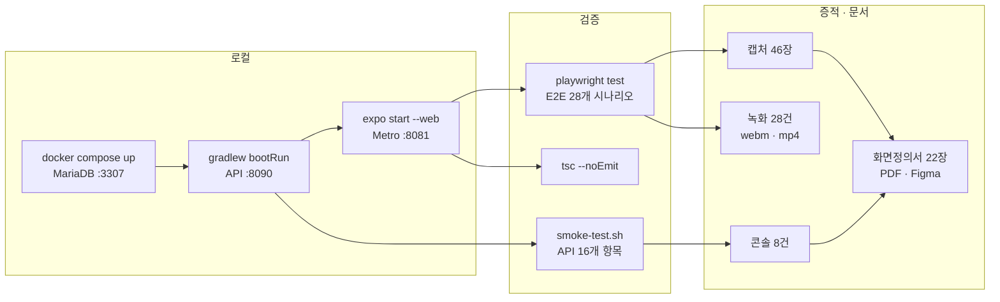
```mermaid
flowchart LR
  subgraph dev["로컬"]
    D1["docker compose up<br/>MariaDB :3307"]
    D2["gradlew bootRun<br/>API :8090"]
    D3["expo start --web<br/>Metro :8081"]
  end

  subgraph verify["검증"]
    V1["smoke-test.sh<br/>API 16개 항목"]
    V2["playwright test<br/>E2E 28개 시나리오"]
    V3["tsc --noEmit"]
  end

  subgraph out["증적 · 문서"]
    O1["캡처 46장"]
    O2["녹화 28건<br/>webm · mp4"]
    O3["콘솔 8건"]
    O4["화면정의서 22장<br/>PDF · Figma"]
  end

  D1 --> D2 --> D3
  D2 --> V1
  D3 --> V2
  D3 --> V3
  V2 --> O1
  V2 --> O2
  V1 --> O3
  O1 --> O4
  O3 --> O4
```

**E2E는 매 실행 전에 DB를 시드로 되돌립니다**(`globalSetup` → `00_reset.sql` + `02_seed.sql`).
예약 → 취소, 신청 → 승인처럼 시나리오가 서로 이어지기 때문에, 되돌리지 않으면
두 번째 실행부터 결과가 달라집니다. 되돌리므로 몇 번을 돌려도 28/28이 같습니다.

| 명령 | 확인하는 것 |
| --- | --- |
| `bash backend/scripts/smoke-test.sh` | 서버 단 규칙 — 차감·복원·중복거부·권한·재환불 차단 |
| `npx playwright test` | 화면까지 포함한 전 시나리오. API로 서버 상태도 함께 대조 |
| `npx tsc --noEmit` | 서버 DTO와 앱 타입의 어긋남 |
| `node tools/capture-console.mjs` | 위 명령을 다시 실행해 출력을 증적으로 남김 |

실행 방법은 [getting-started.md](getting-started.md)에 있습니다.
