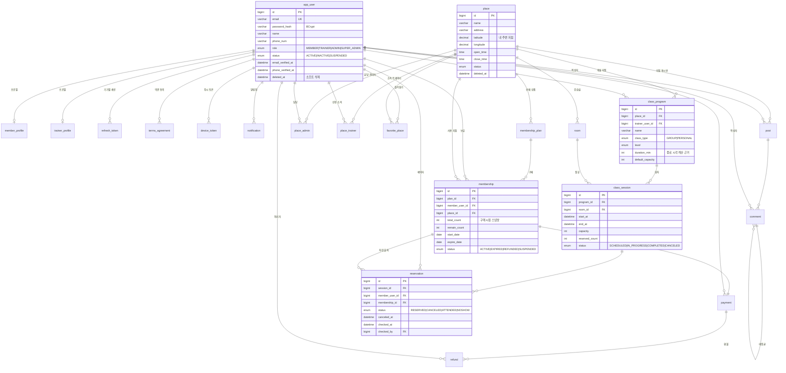
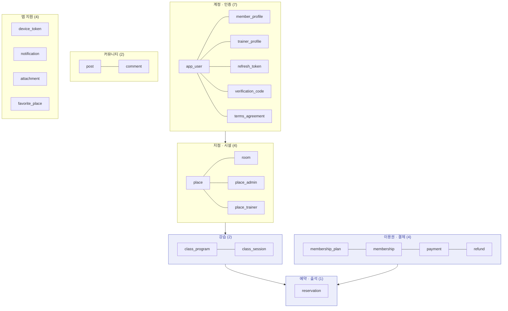
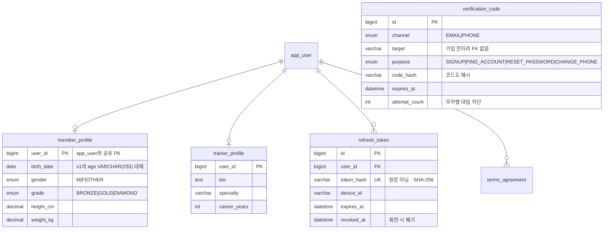
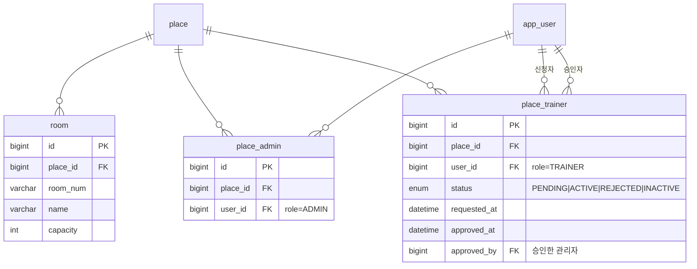
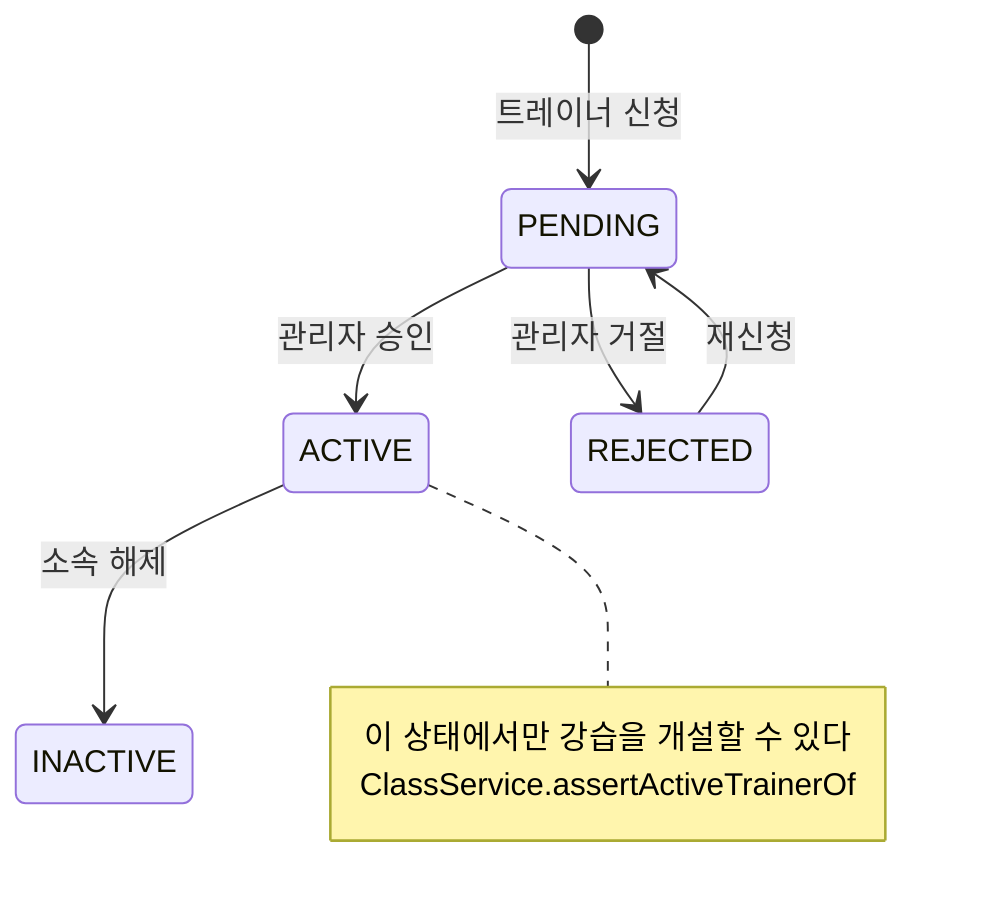
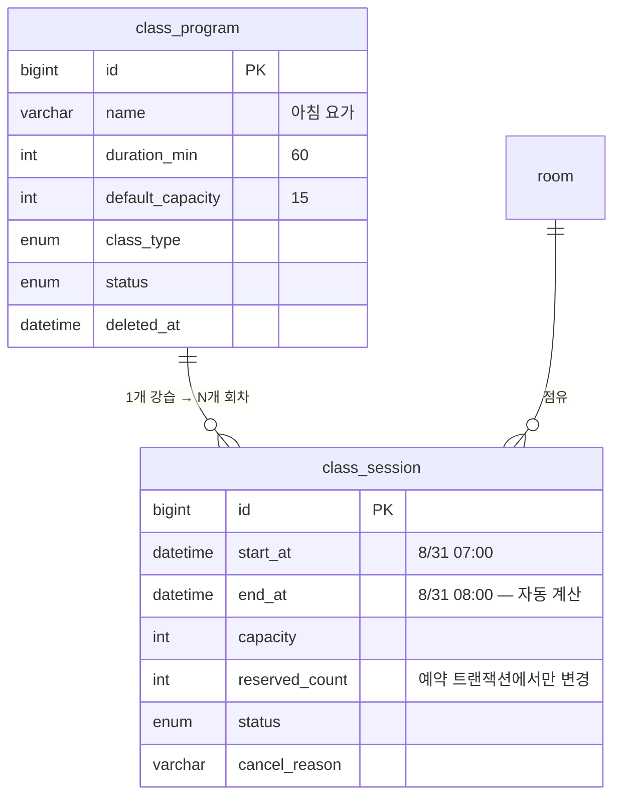
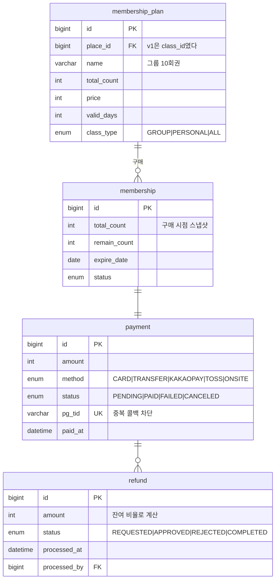
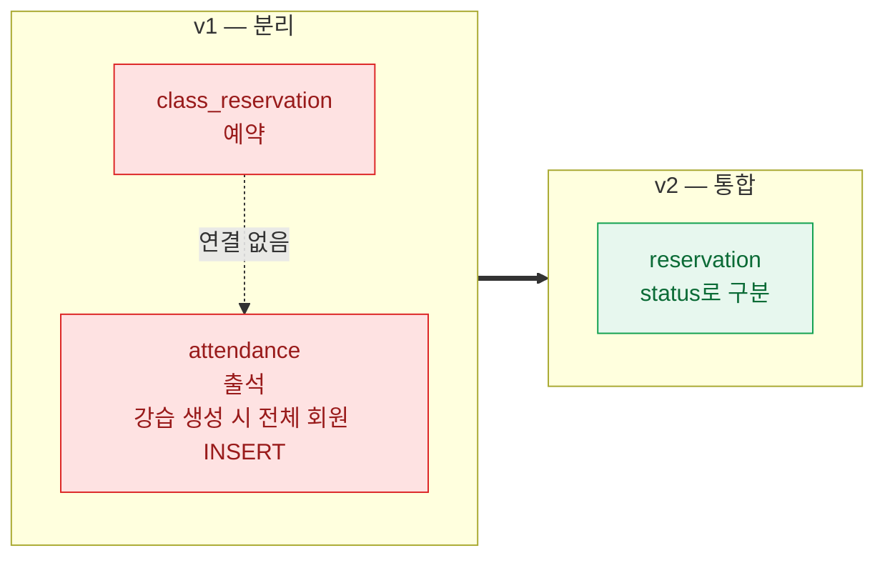
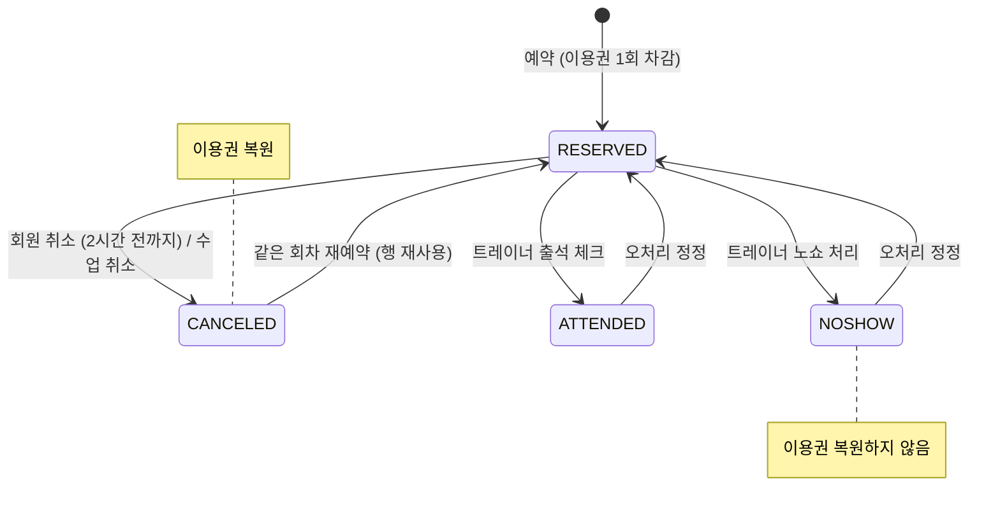
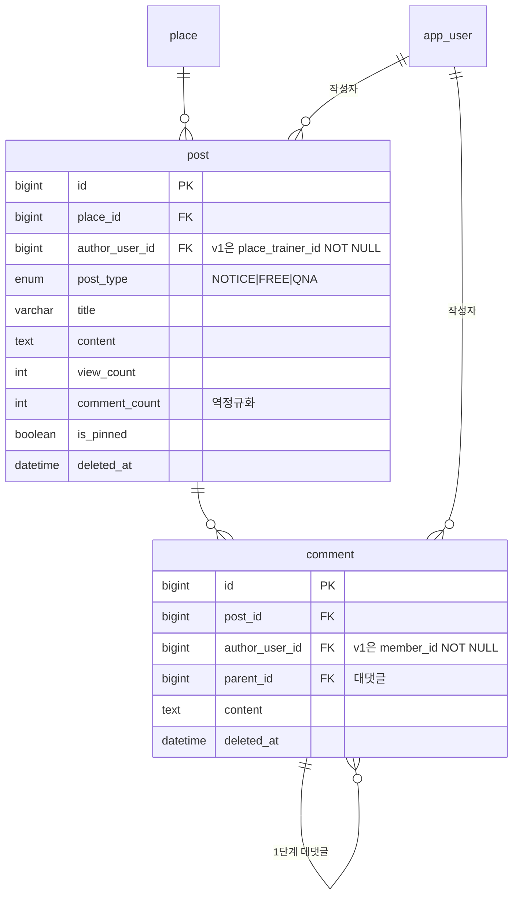

# ERD — 스키마 v2

`db/v2/01_schema.sql`의 실제 구조입니다. 테이블 23개, 뷰 2개.
FK와 UNIQUE 제약은 실행 중인 DB의 `information_schema`에서 뽑아 그대로 옮겼습니다.

v1에서 **왜** 바꿨는지는 [schema-v2.md](schema-v2.md)에, 전체 아키텍처는
[architecture.md](architecture.md)에 있습니다.

- [1. 전체 ERD](#1-전체-erd)
- [2. 도메인별 상세](#2-도메인별-상세)
- [3. 제약 목록](#3-제약-목록)
- [4. v1 → v2 대응표](#4-v1--v2-대응표)
- [5. 뷰](#5-뷰)

---

## 1. 전체 ERD

읽기 편하도록 도메인을 색으로 나눴습니다.
`app_user`와 `place`가 대부분의 테이블이 매달리는 두 축입니다.



### 한눈에 보는 구조



`verification_code`와 `attachment`는 FK가 없습니다.
인증코드는 가입 전에도 발급되어야 하고(계정이 아직 없다), 첨부는 `owner_type` + `owner_id`로
여러 종류의 소유자를 가리킵니다.

---

## 2. 도메인별 상세

### 2.1 계정 · 인증

v1은 `member` · `trainer` · `admin` 세 테이블이 각각 이메일·비밀번호를 들고 있었습니다.
로그인 주체가 셋이면 토큰 하나로 세 역할을 다룰 수 없어 `app_user`로 합쳤습니다.



프로필을 별도 테이블로 둔 이유는 회원과 트레이너가 필요로 하는 컬럼이 겹치지 않기 때문입니다.
`app_user`에 다 넣으면 절반이 항상 NULL입니다. `@MapsId`로 PK를 공유해 조인 비용은 없습니다.

### 2.2 지점 · 시설



`place_admin`이 새로 생긴 테이블입니다. v1의 `admin`에는 `place_id`가 없어
README가 말하는 "지점 담당자"를 표현할 수 없었습니다.

`place_trainer.status`는 v1에서 `ENUM('ACTIVE','INACTTIVE')`였고(오타 포함),
승인 대기를 표현하려고 ENUM에 없는 `'N'`을 넣으려 해 INSERT 자체가 실패했습니다.
v2는 4개 상태를 정식으로 둡니다.



### 2.3 강습 — 2단 구조

v1의 `class`는 `start_time` 하나만 가진 **단일 회차**였습니다.
그런데 이용권은 10회권이었습니다. 회차가 하나뿐인 수업에 10회권을 파는 것은 성립하지 않습니다.



`end_at`이 생기면서 두 가지가 해결됩니다.

| v1 | v2 |
| --- | --- |
| 진행중 판정을 `start_time + 2시간`으로 하드코딩 | `start_at ≤ now < end_at` |
| 강습실 충돌을 1시간 고정으로 검사 | 실제 구간 겹침 `start < :end AND end > :start` |

또한 v1에는 `room_reserve`라는 별도 예약 경로가 있어 같은 방을 이중으로 잡을 수 있었습니다.
v2는 그 테이블을 없애고 `class_session`이 강습실 점유의 유일한 소스입니다.

### 2.4 이용권 · 결제



**`membership_plan.place_id`가 v1과의 가장 큰 차이입니다.**
v1은 `membership_option.class_id` — 이용권이 수업 1개에 묶여 있었습니다.
v2는 지점 + 이용 범위 기준이라 "강남점 그룹 10회권으로 아무 그룹 수업이나 예약"이 성립합니다.

`total_count`를 `membership`에도 복사해 두는 것은 의도적인 비정규화입니다.
상품 가격이나 횟수가 나중에 바뀌어도 이미 판 이용권은 영향받지 않아야 합니다.

### 2.5 예약 · 출석 — 통합

v1은 `class_reservation`(예약)과 `attendance`(출석)가 **FK 없이 따로** 있었습니다.
그리고 강습을 만들 때마다 전체 회원을 `attendance`에 넣고, 그 행 수를 예약 인원으로 표시했습니다.





`CANCELED → RESERVED` 전이가 있는 이유는 `UNIQUE(session_id, member_user_id)` 때문입니다.
취소했다가 같은 회차를 다시 예약하면 새 행을 넣을 수 없어 기존 행을 되살립니다
(`Reservation.reactivate`).

### 2.6 커뮤니티



작성자를 `app_user`로 통일한 것이 핵심입니다. v1은 게시글이 트레이너 전용,
댓글이 회원 전용이라 **트레이너가 댓글을 달 수 없었습니다.**

---

## 3. 제약 목록

### UNIQUE

| 테이블 | 컬럼 | 막는 것 |
| --- | --- | --- |
| `app_user` | `email` | 이메일 중복 가입 |
| `reservation` | `session_id`, `member_user_id` | **같은 회차 중복 예약** |
| `class_session` | `room_id`, `start_at` | 같은 방 같은 시각 중복 개설 |
| `room` | `place_id`, `room_num` | 지점 내 강습실 번호 중복 |
| `place_trainer` | `place_id`, `user_id` | 같은 지점에 중복 소속 신청 |
| `place_admin` | `place_id`, `user_id` | 같은 지점에 중복 담당 지정 |
| `favorite_place` | `user_id`, `place_id` | 즐겨찾기 중복 |
| `payment` | `pg_tid` | PG 중복 콜백으로 인한 이중 결제 |
| `refresh_token` | `token_hash` | 토큰 충돌 |
| `device_token` | `token` | 기기 토큰 중복 등록 |

`reservation`의 복합 UNIQUE는 애플리케이션 락을 뚫고 들어온 동시 요청까지 잡는 **최후 방어선**입니다.
서비스는 이 제약 위반을 `ALREADY_RESERVED`로 변환합니다.

### CHECK

| 테이블 | 조건 | 의미 |
| --- | --- | --- |
| `class_session` | `end_at > start_at` | 끝이 시작보다 빠를 수 없다 |
| `class_session` | `capacity > 0` | 정원 0인 수업은 열 수 없다 |
| `membership` | `0 ≤ remain_count ≤ total_count` | 잔여가 음수이거나 총량을 넘을 수 없다 |
| `membership_plan` | `total_count > 0`, `price ≥ 0` | |
| `refund` | `amount ≥ 0` | |

### 인덱스

v1에는 FK 인덱스 외에 조회용 인덱스가 없었습니다. v2는 실제 조회 경로마다 둡니다.

| 인덱스 | 쓰이는 곳 |
| --- | --- |
| `class_session(start_at, status)` | 시간표 |
| `class_session(room_id, start_at, end_at)` | 강습실 충돌 검사 |
| `reservation(member_user_id, status, reserved_at)` | 내 예약 목록 |
| `reservation(session_id, status)` | 예약자 명단 · 정원 집계 |
| `membership(member_user_id, status)` | 이용권 선택 |
| `place(latitude, longitude)` | 내 주변 지점 (박스 필터) |
| `post(place_id, deleted_at, is_pinned, created_at)` | 게시판 목록 |
| `notification(user_id, read_at, created_at)` | 알림함 · 뱃지 |

---

## 4. v1 → v2 대응표

| v1 | v2 | 변화 |
| --- | --- | --- |
| `member`, `trainer`, `admin` | `app_user` + `member_profile` + `trainer_profile` | 로그인 주체 통합, role로 구분 |
| — | `place_admin` | **신규.** 지점 담당자를 표현할 수 없었다 |
| `class` | `class_program` + `class_session` | 강습 정의와 회차 분리 |
| `class_reservation` + `attendance` | `reservation` | 통합, status로 구분 |
| `membership_option` | `membership_plan` | `class_id` → `place_id` + `class_type` |
| `room_reserve` | *(삭제)* | 강습실 이중 예약 경로 제거 |
| `comment`(회원 전용) | `comment`(작성자 = app_user) | 트레이너도 댓글 가능 |
| `post`(트레이너 전용) | `post`(작성자 = app_user) | 회원 문의글 가능 |
| — | `verification_code` | **신규.** "인증 기반"이라 했지만 저장할 곳이 없었다 |
| — | `refresh_token` | **신규.** 기기별 세션 |
| — | `device_token`, `notification` | **신규.** 푸시·알림함 |
| — | `attachment`, `favorite_place`, `terms_agreement` | **신규** |
| `member.age VARCHAR(255)` | `member_profile.birth_date DATE` | 타입 정정 |
| `ENUM('ACTIVE','INACTTIVE')` | `ENUM('ACTIVE','INACTIVE')` | 오타 수정 |
| 물리 DELETE | `deleted_at` 소프트 삭제 | 이력 보존 |

테이블 수: **13개 → 23개**. 늘어난 10개 중 7개는 모바일 앱에 필요해 새로 만든 것입니다
(인증코드, 리프레시 토큰, 기기 토큰, 알림, 첨부, 즐겨찾기, 약관 동의).

---

## 5. 뷰

### `v_session_detail`

앱의 수업 카드 하나를 그리는 데 필요한 값을 한 번에 가져옵니다.
`class_session` → `class_program` → `place` / `room` / `app_user`(트레이너) 조인을 감싼 것입니다.

```sql
SELECT s.id AS session_id, s.start_at, s.end_at, s.capacity, s.reserved_count,
       (s.capacity - s.reserved_count) AS remain_seat,
       p.name AS program_name, p.class_type, p.level,
       pl.name AS place_name, r.room_num, t.name AS trainer_name
FROM class_session s
JOIN class_program p  ON s.program_id = p.id
JOIN place         pl ON p.place_id = pl.id
JOIN room          r  ON s.room_id = r.id
JOIN app_user      t  ON p.trainer_user_id = t.id
LEFT JOIN trainer_profile tp ON tp.user_id = t.id;
```

### `v_place_revenue`

지점별 매출 통계입니다. v1에서 흩어져 있던 집계 쿼리를 뷰로 고정했습니다.

```sql
SELECT pl.id AS place_id, pl.name AS place_name,
       COUNT(DISTINCT ms.member_user_id) AS member_count,
       COALESCE(SUM(pay.amount), 0) AS total_paid,
       COALESCE(SUM(rf.amount), 0)  AS total_refunded,
       COALESCE(SUM(pay.amount), 0) - COALESCE(SUM(rf.amount), 0) AS net_revenue
FROM place pl
LEFT JOIN membership ms ON ms.place_id = pl.id
LEFT JOIN payment pay   ON pay.membership_id = ms.id AND pay.status = 'PAID'
LEFT JOIN refund  rf    ON rf.payment_id = pay.id AND rf.status = 'COMPLETED'
GROUP BY pl.id, pl.name;
```

> API는 뷰를 직접 쓰지 않습니다. JPA 엔티티로 조회하고 `JOIN FETCH`로 N+1을 피합니다.
> 뷰는 운영 중 DB에서 바로 확인하거나 통계를 뽑을 때 씁니다.
