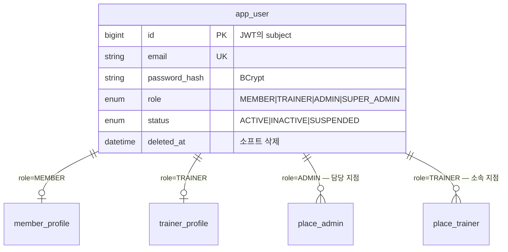
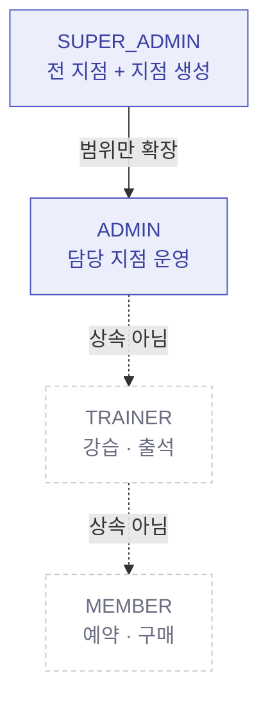
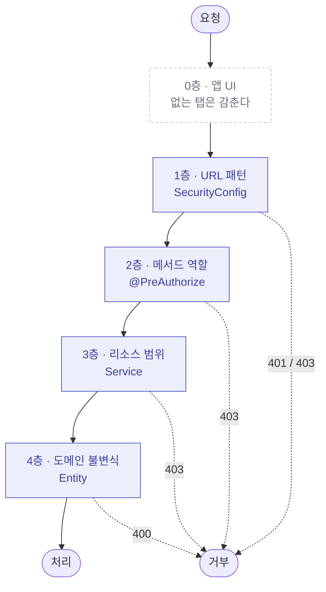
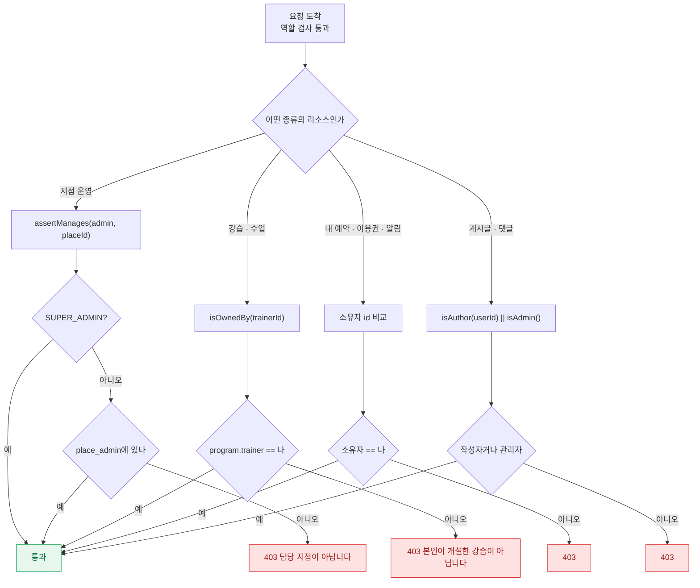
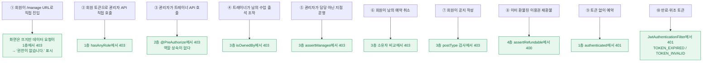
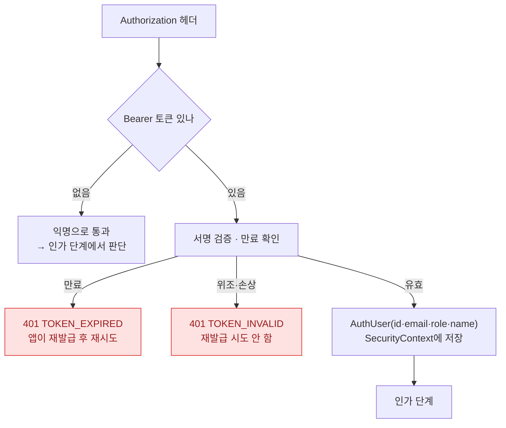
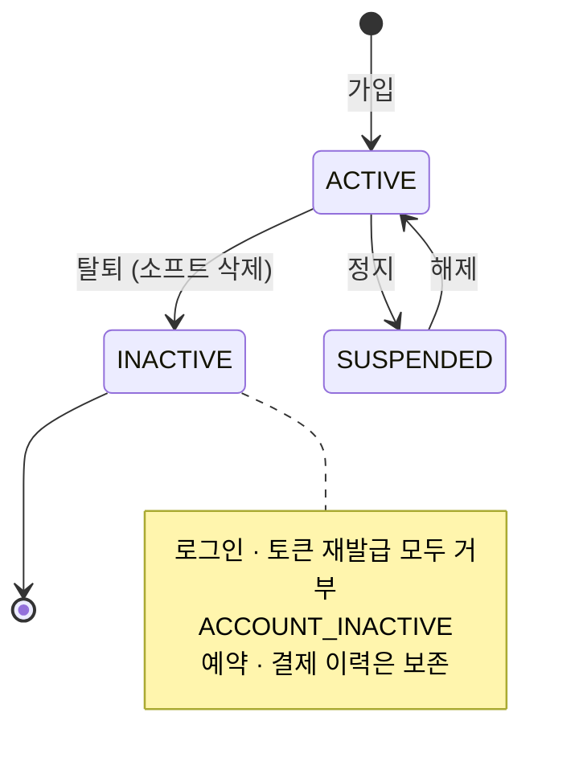

# RBAC — 역할 기반 접근 제어

누가 무엇을 할 수 있는지, 그것을 **어디에서 강제하는지** 정리한 문서입니다.
전체 구조는 [architecture.md](architecture.md)에 있습니다.

- [1. 역할 정의](#1-역할-정의)
- [2. 4단 방어](#2-4단-방어)
- [3. 권한 매트릭스](#3-권한-매트릭스)
- [4. 강제 지점별 상세](#4-강제-지점별-상세)
- [5. 우회 시도와 차단](#5-우회-시도와-차단)
- [6. 검증](#6-검증)
- [7. 설계 판단과 한계](#7-설계-판단과-한계)

---

## 1. 역할 정의

v1은 `member` · `trainer` · `admin` 세 테이블이 각각 이메일과 비밀번호를 들고 있어
**로그인 주체가 셋으로 갈라져 있었습니다.** 토큰 하나로 세 역할을 다루려면 주체가 하나여야 합니다.
v2는 `app_user` 하나로 합치고 `role` 컬럼으로 구분합니다.



| 역할 | 한 문장 | 범위를 정하는 테이블 |
| --- | --- | --- |
| `MEMBER` | 수업을 예약하고 이용권을 산다 | — (전 지점 이용 가능) |
| `TRAINER` | 승인된 지점에서 강습을 열고 출석을 관리한다 | `place_trainer` (status=ACTIVE) |
| `ADMIN` | **담당 지점**의 운영을 한다 | `place_admin` |
| `SUPER_ADMIN` | 전 지점 + 지점 생성 | — (제약 없음) |

**역할은 계층이 아닙니다.** `ADMIN`이 `TRAINER`의 상위가 아닙니다.
관리자는 강습을 개설할 수 없고, 트레이너는 환불을 승인할 수 없습니다.
`SUPER_ADMIN`만 `ADMIN`의 범위를 넓힌 형태입니다.



`ADMIN`이 트레이너 API를 부르면 **403**입니다. 운영자가 강습을 대신 만드는 흐름이 필요하면
별도 엔드포인트를 만들어야 하며, 역할 상속으로 열지 않습니다.

---

## 2. 4단 방어

권한 검사를 한 곳에만 두면 그 한 곳이 뚫리면 끝입니다. 성격이 다른 네 층에 나눠 두었습니다.



| 층 | 무엇을 보는가 | 예 |
| --- | --- | --- |
| 0 · 앱 UI | 역할 | 관리자 탭을 회원에게 안 보인다 — **편의일 뿐 방어가 아니다** |
| 1 · URL 패턴 | 인증 여부 · 역할 | `/api/admin/**` → `ADMIN` 이상 |
| 2 · 메서드 | 역할 | 예약 3종 → `MEMBER`, 트레이너 API 전체 → `TRAINER` |
| 3 · 서비스 | **이 리소스가 내 것인가 / 내 담당인가** | 담당 지점인가, 본인이 만든 강습인가, 본인 예약인가 |
| 4 · 엔티티 | 상태로 봤을 때 가능한 동작인가 | 이미 환불된 이용권은 재환불 불가 |

**3층이 핵심입니다.** 1·2층은 "관리자인가"까지만 답합니다.
"이 관리자가 **이 지점의** 관리자인가"는 데이터를 봐야 알 수 있고, 그건 서비스의 몫입니다.

---

## 3. 권한 매트릭스

`○` 허용 · `—` 403 · `◑` 조건부(3층에서 범위 검사)

### 인증 · 공개

| 엔드포인트 | 비로그인 | MEMBER | TRAINER | ADMIN | SUPER |
| --- | :-: | :-: | :-: | :-: | :-: |
| `POST /api/auth/**` (가입·로그인·재발급·인증번호) | ○ | ○ | ○ | ○ | ○ |
| `GET /api/places/**` (지점·시간표·게시글 목록) | ○ | ○ | ○ | ○ | ○ |
| `GET /api/sessions/{id}` | ○ | ○ | ○ | ○ | ○ |

지점과 시간표는 로그인 없이 둘러볼 수 있습니다. 앱을 깔자마자 무엇을 파는지 보이는 편이 낫고,
개인정보가 없는 데이터입니다.

### 회원

| 엔드포인트 | 비로그인 | MEMBER | TRAINER | ADMIN | SUPER |
| --- | :-: | :-: | :-: | :-: | :-: |
| `POST /api/reservations` | — | ○ | — | — | — |
| `GET /api/reservations/me` | — | ○ | — | — | — |
| `DELETE /api/reservations/{id}` | — | ◑ 본인 | — | — | — |
| `POST /api/me/memberships` (구매) | — | ○ | — | — | — |
| `POST /api/me/memberships/{id}/refund` | — | ◑ 본인 | — | — | — |
| `GET /api/me/**` (프로필·알림·즐겨찾기) | — | ○ | ○ | ○ | ○ |

### 커뮤니티

| 엔드포인트 | 비로그인 | MEMBER | TRAINER | ADMIN | SUPER |
| --- | :-: | :-: | :-: | :-: | :-: |
| `POST /api/places/{id}/posts` — 자유·문의 | — | ○ | ○ | ○ | ○ |
| `POST /api/places/{id}/posts` — **공지** | — | — | ○ | ○ | ○ |
| `POST /api/posts/{id}/comments` | — | ○ | ○ | ○ | ○ |
| `PATCH`·`DELETE /api/posts/{id}` | — | ◑ 작성자 | ◑ 작성자 | ◑ 작성자·관리자 | ◑ |

v1은 게시글이 트레이너 전용(`place_trainer_id NOT NULL`), 댓글이 회원 전용(`member_id NOT NULL`)이라
**트레이너가 댓글을 달 수 없었습니다.** v2는 작성자를 `app_user`로 통일했습니다.

### 트레이너

| 엔드포인트 | MEMBER | TRAINER | ADMIN | SUPER |
| --- | :-: | :-: | :-: | :-: |
| `POST /api/trainer/places` (소속 신청) | — | ○ | — | — |
| `POST /api/trainer/programs` (강습 개설) | — | ◑ ACTIVE 소속 | — | — |
| `PATCH`·`DELETE /programs/{id}` | — | ◑ 본인 강습 | — | — |
| `POST /programs/{id}/sessions` (회차 개설) | — | ◑ 본인 강습 | — | — |
| `GET /sessions/{id}/roster` (예약자 명단) | — | ◑ 본인 수업 | — | — |
| `POST /sessions/{id}/attendance` (출석) | — | ◑ 본인 수업 | — | — |
| `POST /sessions/{id}/cancel` (수업 취소) | — | ◑ 본인 수업 | — | — |

### 관리자

| 엔드포인트 | MEMBER | TRAINER | ADMIN | SUPER |
| --- | :-: | :-: | :-: | :-: |
| `POST /api/admin/places` (지점 생성) | — | — | **—** | ○ |
| `PATCH`·`DELETE /admin/places/{id}` | — | — | ◑ 담당 | ○ |
| `POST /admin/places/{id}/rooms`·`/plans` | — | — | ◑ 담당 | ○ |
| `GET /admin/places/{id}/trainers/pending` | — | — | ◑ 담당 | ○ |
| `POST /admin/place-trainers/{id}/decision` | — | — | ◑ 담당 | ○ |
| `GET /admin/members`·`/trainers` | — | — | ○ | ○ |
| `POST /admin/refunds/{id}/decision` | — | — | ◑ 담당 | ○ |

지점 생성만 `SUPER_ADMIN` 전용입니다. 지점 관리자가 새 지점을 만들 이유가 없습니다.

---

## 4. 강제 지점별 상세

### 1층 — URL 패턴 (`SecurityConfig`)

```java
.requestMatchers("/api/auth/**").permitAll()
.requestMatchers(HttpMethod.GET, "/api/places/**").permitAll()   // GET만 연다
.requestMatchers(HttpMethod.GET, "/api/sessions/**").permitAll()
.requestMatchers("/api/admin/**").hasAnyRole("ADMIN", "SUPER_ADMIN")
.anyRequest().authenticated()
```

`HttpMethod.GET`을 명시한 것이 중요합니다. `/api/places/**`를 통째로 열면
`POST /api/places/{id}/posts`(글쓰기)까지 비로그인에 열립니다.
GET만 열었으므로 POST는 `anyRequest().authenticated()`로 떨어집니다.

세션은 쓰지 않습니다(`STATELESS`). CSRF도 끕니다 — 쿠키가 아니라 `Authorization` 헤더를 쓰므로
브라우저가 자동으로 자격증명을 실어 보내지 않습니다.

### 2층 — 메서드 역할 (`@PreAuthorize`)

```java
// ReservationController — 예약은 회원만
@PreAuthorize("hasRole('MEMBER')")
@PostMapping("/api/reservations")

// TrainerController — 클래스 전체에 걸어 개별 누락을 없앤다
@RestController
@RequestMapping("/api/trainer")
@PreAuthorize("hasRole('TRAINER')")
public class TrainerController { ... }

// MeController — 회원 도메인 동작만 좁힌다
@PreAuthorize("hasRole('MEMBER')")
@PostMapping("/memberships")          // 이용권 구매
```

`@EnableMethodSecurity`가 켜져 있어야 동작합니다(`SecurityConfig`).
클래스 레벨에 거는 편이 안전합니다 — 메서드를 새로 추가할 때 어노테이션을 빠뜨려도 보호됩니다.

토큰의 `role` 클레임이 `ROLE_` 접두사가 붙은 권한으로 변환됩니다.

```java
// JwtAuthenticationFilter
new SimpleGrantedAuthority("ROLE_" + role.name())   // ROLE_MEMBER, ROLE_ADMIN …
```

### 3층 — 리소스 범위 (Service)

역할만으로는 부족한 세 가지를 여기서 봅니다.



```java
// AdminService — 담당 지점 검사. SUPER_ADMIN은 통과시킨다.
public void assertManages(AuthUser admin, Long placeId) {
    if (admin.role() == Enums.Role.SUPER_ADMIN) return;
    if (!placeAdminRepository.existsByPlaceIdAndAdminId(placeId, admin.id())) {
        throw new ApiException(ErrorCode.FORBIDDEN, "담당 지점이 아닙니다.");
    }
}

// ClassService — 소속 승인 여부. 신청만 하고 승인 전이면 개설할 수 없다.
private void assertActiveTrainerOf(Long placeId, Long trainerId) {
    boolean ok = placeTrainerRepository.existsByPlaceIdAndTrainerIdAndStatus(
            placeId, trainerId, Enums.PlaceTrainerStatus.ACTIVE);
    if (!ok) throw new ApiException(ErrorCode.TRAINER_NOT_IN_PLACE);
}
```

### 4층 — 도메인 불변식 (Entity)

권한이 있어도 **상태가 허락하지 않으면** 막습니다.

```java
// Membership — v1 회고에 미해결로 남았던 재환불 문제
public void assertRefundable() {
    if (status == REFUNDED)  throw new ApiException(MEMBERSHIP_NOT_REFUNDABLE, "이미 환불된 이용권입니다.");
    if (status == EXPIRED || isExpired())
                             throw new ApiException(MEMBERSHIP_NOT_REFUNDABLE, "만료된 이용권은 환불할 수 없습니다.");
    if (remainCount <= 0)    throw new ApiException(MEMBERSHIP_NOT_REFUNDABLE, "잔여 횟수가 없어 환불할 수 없습니다.");
}

// Reservation — 본인 예약이어도 기한이 지나면 못 취소한다
public void cancelByMember() {
    if (status != RESERVED) throw new ApiException(RESERVATION_NOT_CANCELABLE);
    if (LocalDateTime.now().isAfter(session.getStartAt().minusHours(2)))
        throw new ApiException(CANCEL_DEADLINE_PASSED);
    ...
}
```

---

## 5. 우회 시도와 차단

앱 UI를 감추는 것은 방어가 아닙니다. 다음 경로들이 실제로 막히는지 확인했습니다.



### 토큰 검증



만료와 위조를 **다른 코드로 구분하는 것**이 중요합니다.
앱은 `TOKEN_EXPIRED`일 때만 재발급을 시도하고, `TOKEN_INVALID`면 바로 로그아웃시킵니다.
구분하지 않으면 위조 토큰으로 재발급을 무한히 두드리게 됩니다.

토큰이 없을 때 필터가 막지 않고 통과시키는 이유는, 공개 엔드포인트(`GET /api/places`)와
보호 엔드포인트가 같은 필터를 지나기 때문입니다. 판단은 인가 단계가 합니다.

### 계정 상태



탈퇴하면 리프레시 토큰을 전부 폐기하고 기기 토큰을 비활성화합니다.
남아 있는 액세스 토큰은 만료될 때까지 유효하지만, 만료 후 재발급이 막혀 자연히 끊깁니다.

---

## 6. 검증

권한 규칙은 코드에 있다고 끝이 아니라 **깨지면 알아야** 합니다. 두 곳에서 확인합니다.

### API 스모크 테스트

```bash
bash backend/scripts/smoke-test.sh
```

| # | 항목 | 확인 |
| --- | --- | --- |
| 2 | 잘못된 비밀번호 | `LOGIN_FAILED` |
| 11 | 토큰 없이 예약 | `401` |
| 12 | 회원 토큰으로 관리자 API | `403` |
| 14 | 트레이너 댓글 작성 | `authorRole=TRAINER` |
| 15 | 회원의 공지 작성 | `FORBIDDEN` |
| 16 | 재환불 요청 | `MEMBERSHIP_NOT_REFUNDABLE` |

### E2E

```bash
cd app && npx playwright test
```

| 시나리오 | 확인 |
| --- | --- |
| 역할에 따라 탭이 달라진다 (트레이너) | 내 예약·이용권 탭이 **없다** |
| 관리자 탭 구성 | 운영 탭이 있고 내 예약 탭이 없다 |
| 회원 계정으로는 관리자 화면에 갈 수 없다 | `/manage` 직접 진입 → "권한이 없습니다." |
| 트레이너 소속 승인 | PENDING → ACTIVE 전이 |

증적은 `docs/evidence/`에 캡처와 녹화로 남습니다
(`46_member-forbidden-admin.png`, `20_trainer-tabs.png`, `34_admin-tabs.png`).

---

## 7. 설계 판단과 한계

### 왜 이렇게 했는가

| 판단 | 이유 | 대안과 비교 |
| --- | --- | --- |
| 역할을 `app_user.role` 단일 컬럼으로 | 이 도메인에서 한 사람이 두 역할을 겸하는 경우가 없다 | `user_role` 다대다 테이블은 조인이 늘고 지금은 이득이 없다 |
| 역할 계층을 두지 않음 | 관리자가 강습을 여는 흐름이 요구사항에 없다 | `RoleHierarchy`를 쓰면 의도치 않은 권한이 상위로 새어 나간다 |
| 담당 지점을 `place_admin` 테이블로 | v1의 `admin`에는 `place_id`가 없어 "지점 담당자"를 표현할 수 없었다 | 컬럼 하나로 두면 한 명이 여러 지점을 못 맡는다 |
| 소유권 검사를 서비스에 | 데이터를 봐야 판단할 수 있다 | `@PreAuthorize`의 SpEL로 표현하면 쿼리가 어노테이션에 숨는다 |
| 무권한을 403, 상태 불가를 400으로 | 앱이 다르게 반응해야 한다 | 섞으면 "권한이 없다"와 "지금은 안 된다"를 구분 못 한다 |

### 지금의 한계

| 한계 | 영향 | 필요해지면 |
| --- | --- | --- |
| 한 계정 = 한 역할 | 트레이너가 다른 지점의 회원이 될 수 없다 | `user_role` 다대다로 확장 |
| 권한이 코드에 하드코딩 | 권한을 바꾸려면 배포해야 한다 | `permission` 테이블 + 역할-권한 매핑 |
| 감사 로그 없음 | 누가 언제 승인/거절했는지 `refund.processed_by` 정도만 남는다 | `audit_log` 테이블 |
| 액세스 토큰 즉시 무효화 불가 | 탈퇴해도 남은 토큰은 만료(기본 60분)까지 유효 | 토큰 블랙리스트(Redis) 또는 만료 단축 |
| `place_admin`이 조회마다 DB를 본다 | 관리자 요청마다 쿼리 1회 추가 | 토큰 클레임에 담당 지점을 넣거나 캐시 |

**액세스 토큰 만료 시간**은 `JWT_ACCESS_MINUTES`로 조정합니다(기본 60분).
즉시 차단이 중요한 서비스라면 짧게 두고 재발급을 자주 하는 편이 낫습니다.
